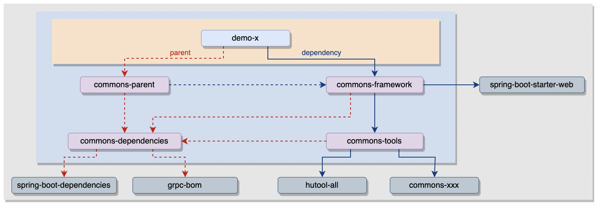

## 文档目的

希望在开发工作中，大家能够有统一的风格，在彼此间形成一种规范约定，以减少不必要的沟通成本


## 1. 工程结构

对于代码结构，我们简单沿用mvc的controller/service/mapper/entity。如果想避免service层之间相互引用，可以在service与mapper之间再加一层manage，来作为service层中的公用处理。考虑到可能还有一些其他的package定义，比如util或者configuration之类，可以在mvc之上加一层api，与启动类保持同级。   

这样包结构看起来会更清晰一点，而且也对应我们的接口定义格式: `http://{ip}:{port}/{cotext-path}/api/v1/xxx`，所以对于一般的springboot应用，我们可以约定如下工程结构：

```txt 
{项目xx}-{服务xxx}
   ├─bin                                      ## 应用脚本
   │  └─env.properties
   │  └─install.sh
   │  └─run.sh
   │  └─setenv.sh
   ├─src
   │  └─main
   │     ├─java
   │     │  └─com.cowave.{项目名}.{服务名}     ## 代码目录
   │     │     ├─api                          
   │     │     │  ├─controller
   │     │     │  │  └─...
   │     │     │  ├─entity
   │     │     │  │  └─...
   │     │     │  ├─mapper
   │     │     │  │  └─...
   │     │     │  └─service
   │     │     │     └─...
   │     │     ├─configuration 
   │     │     │  └─...
   │     │     ├─...
   │     │     └─Application.java
   │     │      
   │     └─resources
   │        ├─smart-doc.json                  ## smart接口文档描述
   │        ├─logback-spring.xml              ## 日志配置
   │        ├─sql                             ## liquibase数据库管理
   │        │  ├─changelog.yml
   │        │  ├─...
   │        ├─config                          ## 应用配置，区分dev和prod
   │        │  ├─application.yml
   │        │  ├─dev
   │        │  │  ├─application.yml
   │        │  │  ├─...
   │        │  └─prod 
   │        │     ├─application.yml
   │        │     ├─...
   │        └─META-INF
   │           ├─info.yml                     ## 默认加载的配置项
   │           └─i18n                         ## 国际化资源
   │              ├─...
   │
   ├─docker.build                             ## 镜像打包
   ├─pom.xml
   └─README.md
```

在微服务项目中，一般多个服务之间会存在存在相互调用，依赖彼此的接口。那么对于这些Rpc接口的调用应该由提供方来定义，然后给各个调用方来作为依赖。而不应该在各个调用的服务中定义，容易造成重复和混乱（也不是绝对，如果服务间的调用比较简单清晰，直接在调用方定义就行，但是当你预感到调用的接口定义会变多导致重复混乱时，就应该及时作出改变）。

针对这种情况，我们需要将代码拆成不同的module，然后将remote模块提供给调用方。参考示例：https://gitlab.cowave.com/commons/demo/demo-xx

```txt 
{项目xx}-{服务xxx}
   ├─xxx-api       ## 依赖xxx-core，对应controller层接口和service层的业务处理
   ├─xxx-core      ## 依赖xxx-model，对应持久层、缓存、或消息中间件的处理，比如数据库mapper，redis或kafka之类的调用处理
   ├─xxx-model     ## 应用模型定义，独立处理是考虑到remote与api可能存在共用的模型定义，如果不存在，那么也可以合并到core中
   ├─xxx-remote    ## 对外提供的Rpc接口，如果复用模型定义，可以依赖xxx-model，也可以使用门面模式单独定义接口的输入输出模型
   ├─xxx-starter   ## 依赖xxx-api，定义启动类及一些配置，独立出来是考虑到可能存在将多个springboot应用合并成一个程序启动的场景
   └─pom.xml
```


## 2. pom.xml约定

### 2.1. maven坐标

请统一按照下面的格式来定义maven坐标

```xml
<groupId>com.cowave.{项目}</groupId>
<artifactId>{项目}-{应用}</artifactId>
```

如果一些没有项目归属的应用，可以使用tools来收纳，参考示例：https://gitlab.cowave.com/tools/tools-net/-/blob/master/pom.xml

```xml
<parent>
    <groupId>com.cowave.commons</groupId>
    <artifactId>commons-parent</artifactId>
    <version>1.0.0</version>
</parent>

<groupId>com.cowave.tools</groupId>
<artifactId>tools-net</artifactId>
<version>1.0.0</version>
<packaging>jar</packaging>
```

如果是公共的依赖jar包，可以使用commons来进行收纳，参考示例：https://gitlab.cowave.com/commons/commons-tools/-/blob/master/pom.xml

```xml
<parent>
    <groupId>com.cowave.commons</groupId>
    <artifactId>commons-dependencies</artifactId>
    <version>1.0.0</version>
</parent>

<artifactId>commons-tools</artifactId>
<version>1.0.0</version>
<packaging>jar</packaging>
```


### 2.2. 结构约定

我们要求***pom.xml里的`<packaging/>`标签不可以省略，并且`<version/>` 和 `<artifactId/>`要在其上方并且仅靠在一起***，比如下面这样：

```xml
<artifactId>commons-tools</artifactId>
<version>1.0.0</version>
<packaging>jar</packaging>
```

这个要求可能显得苛刻，但是为了在打包构建等一些过程中能方便准确地获取到打包名称和版本（定位到`<packaging/>`所在行，然后从上面4行中寻找`<version/>`和`<artifactId/>`），这是一个相对简单的办法


### 2.3. parent约定

如果构建依赖jar包，请使用`commons-dependencies`作为parent；如果构建spring-boot应用，请使用`commons-parent`作为parent。

我们提供了一套commons包，其中关系可以如下所示：



`commons-dependencies`中定义了打包Jar常用的插件，比如对于代码检查我们定义了插件maven-pmd-plugin，默认会在编译之前检查代码规范。有的特殊场景可能导致我们不得不违背一些规范，那么对于这些文件，可以配置进行排除（但是不建议修改检查级别甚至直接关掉代码检查），比如

```xml
<build>
    <plugins>
        <plugin>
            <groupId>org.apache.maven.plugins</groupId>
            <artifactId>maven-pmd-plugin</artifactId>
            <configuration>
                <excludes>
                    <exclude>**/access/AccessLogger.java</exclude>
                </excludes>
            </configuration>
        </plugin>
    </plugins>
</build>
```

`commons-parent`中了打包springboot应用所需的插件，但是需要自己主动声明（考虑多module的maven应用），可以参考上面的demo示例：

```xml
<build>
    <plugins>
        <plugin>
            <groupId>org.springframework.boot</groupId>
            <artifactId>spring-boot-maven-plugin</artifactId>
        </plugin>
    </plugins>
</build>

<profiles>
    <profile>
        <id>unix</id>
        <activation>
            <os>
                <family>unix</family>
            </os>
        </activation>
        <build>
            <plugins>
                <plugin>
                    <groupId>org.apache.maven.plugins</groupId>
                    <artifactId>maven-antrun-plugin</artifactId>
                </plugin>
                <plugin>
                    <artifactId>exec-maven-plugin</artifactId>
                    <groupId>org.codehaus.mojo</groupId>
                </plugin>
            </plugins>
        </build>
    </profile>
</profiles>
```

如果希望对jar包进行加密，则需要再声明下classfinal插件（对应的在env.properties中，需要开启的参数：java_agent=on）

```xml
<plugin>
    <groupId>net.roseboy</groupId>
    <artifactId>classfinal-maven-plugin</artifactId>
</plugin>
```

`commons-framework`针对springboot-web应用做了一些通用性的处理，如果没有特殊原因，我们要求统一使用依赖commons-framework作为基础依赖（详细内容参考《Java开发文档》）

```xml
<dependency>
    <groupId>com.cowave.commons</groupId>
    <artifactId>commons-framework</artifactId>
</dependency>
```


## 3. bin脚本

以下是我们针对springboot应用提供的一套脚本（考虑了物理机部署和容器部署），固定放在工程根目录下的bin中。

命令`mvn install`默认会打一个Tar包，如果是要打成docker镜像和deb包，对应的也提供了docker.build和dpk.build

```txt
run.sh          ## 【不需要修改】启动脚本，提供常见的操作：start/stop/restart/config/status/version
install.sh      ## 【不需要修改】安装脚本，程序文件拷贝到$app_home目录，我们安装之后的目录结构统一为：bin、config、lib、log
setenv.sh       ##  提供一些配置，比如安装目录$app_home，另外定义了安装时要拷贝哪些文件，以及启动时要修改哪些配置
env.properties  ##  定义setenv.sh中可以使用的配置
```


### 3.1. env.properties

定义jvm参数，还有应用启动时需要设置的环境变量（如果在设置时发现在环境变量中已经存在，则以环境变量为准）：

```properties
####################################################################### JVM
#### java环境目录，为空则取从当前环境获取
java_home=
#### 应用启动参数
jvm_option=-Xms256m -Xmx256m -XX:MetaspaceSize=128m -XX:+HeapDumpOnOutOfMemoryError
#### jvm参数：JMX端口
#jvm_option=-Djava.rmi.server.hostname=0.0.0.0
#jvm_option=-Dcom.sun.management.jmxremote
#jvm_option=-Dcom.sun.management.jmxremote.port=29999
#jvm_option=-Dcom.sun.management.jmxremote.ssl=false
#jvm_option=-Dcom.sun.management.jmxremote.authenticate=false
#### jvm参数：debug端口
#jvm_option=-agentlib:jdwp=transport=dt_socket,server=y,suspend=n,address=0.0.0.0:19999
#### 启用加密包Agent(on/off)
java_agent=off

####################################################################### HTTP
#### 服务Http端口
server_port=38080
```

`目的是让开发可以将应用需要配置项统一提取到env.properties中，这样运维工程人员就不需要关心应用中具体的配置文件了`


### 3.2. setenv.sh

setenv.sh中约定了如下配置项，其中`app_name`如果为空，则默认会取当前pom.xml中的artifactId。`app_home`定义了应用安装的目录，可以根据情况自行修改，默认为：/opt/cowave

```properties
## 应用名称
export app_name=""
## 应用目录
export app_home="/opt/cowave/$app_name"
## 应用版本
export app_version=""
## 代码版本
export code_version=""
## 打包时间
export build_time=""
## 安装时间
export install_time=""
## 启动时间
export start_time=""
```

在`config()`方法中， 可以使用`env.properties`设置的环境变量来修改配置文件（如果是容器启动，可以将env.properties中的变量定义成容器的环境变量）。

修改示例：（这里replace是一个替换方法，使用方式：`replace {文件路径} {配置项} {配置项在文件第几次出现}`）

```shell
config(){
    ## server.port
    replace $app_home/config/application.yml port "$server_port" 1
}
```

当然，对于直接的环境变量替换，我们使用Spring的方式可以更方便，比如：

```yaml
server:
  port: ${server_port:19010}
  servlet:
    context-path: /admin
```


### 3.3. run.sh

run.sh并不需要修改，这里说明一下默认追加的启动参数：

```shell
jvm_option="$jvm_option -Duser.dir=$app_home -Dspring.config.location=$app_home/config/"
```

如果检测到${app_home}/config/prod目录，则追加参数

```shell
jvm_option="$jvm_option -Dspring.profiles.active=prod"
```

如果java_agent设置为on（jar包加密），则追加参数

```shell
jvm_option="$jvm_option -javaagent:$app_home/lib/$app_name-$app_version.jar"
```


## 4. 配置管理

### 4.1. 配置约定

配置文件的**格式约定：.yml**；配置文件的目录约定：**/resources/config**

**如果启用profile，那么约定以子目录进行分类**，比如常用的dev（本地开发环境）和prod（线上部署环境）两个profile。那么我们可以将两套配置文件分别放在两个子目录中，然后通过外层`resources/config/application.yml`进行引用，比如：

```yaml
spring:
  config:
    activate:
      on-profile: dev
    import:
      - dev\application.yml     
      - dev\application-datasource.yml
      - dev\application-kafka.yml
      - dev\application-redis.yml
---
spring:
  config:
    activate:
      on-profile: prod
    import:
      - prod\application.yml
      - prod\application-datasource.yml
      - prod\application-kafka.yml
      - prod\application-redis.yml
```

为了避免单个配置文件中的配置太多而显得过于臃肿，这里使用了多个文件来对不同类型的配置进行划分；


### 4.2. 默认配置

对于一些一般不用修改的默认的配置（自定义的默认配置，与spring配置的默认值不一样），我们可以定义到`resources/META-INF/info.yml`中，这样可以让config下的配置文件更加简洁（commons-framework会在应用启动时尝试加载这里面的配置，并将优先级放在最低，以便config下面的配置还可以对配置项进行覆盖）


## 5. log日志管理

参考示例：https://gitlab.cowave.com/commons/demo/demo-sys/sys-admin/-/blob/master/src/main/resources/logback-spring.xml

我们约定了一套logback-spring.xml配置（大部分场景下不用修改），默认会打印三个日志文件：

```txt
access.log  ## 访问日志，restful接口相关的日志，包括请求响应，以及处理过程中的打印；
boot.log    ## 脚本输出，以及一些启动信息；
root.log    ## 根日志，除去restful之外的其它所有日志；

```


## 6. smart接口文档

对于应用的Controller接口，我们统一使用smart根据注释生成和管理接口文档；

参考示例：https://gitlab.cowave.com/commons/demo/demo-sys/sys-admin/-/blob/master/src/main/resources/smart-doc.json


## 7. liquibase数据库管理

对于使用了数据库的应用，我们要求统一使用liquibase来进行管理版本管理（应用在启动时检查更新数据库，不用运维干预）

参考示例：https://gitlab.cowave.com/commons/demo/demo-sys/sys-admin/-/blob/master/src/main/resources/sql/changelog.yml


## 8. 单元测试

对于单元测试的编写，很多时候都会依赖一些环境，比如各种数据库存储或消息中间件。这里我们推荐使用 [testcontainers](https://java.testcontainers.org) ，它会基于docker拉起一个测试环境，并负责管理容器的生命周期，这样如果数据是基于liquibase管理，每次测试都会初始化一个干净的库。

对于一些常见的外部服务Feign调用，我们可以通过一些简单的技巧，比如手动创建接口实例，然后在容器中声明为`@Primary`，这样在测试中就能正常调用依赖接口，并返回我们手动构造的结果。

参考示例：https://gitlab.cowave.com/commons/demo/demo-sys/sys-admin.git


## 9. 应用部署

根据约定的打包，java应用在部署后始终应该只有4个目录（容器部署与物理机部署一样）：**bin/**、**lib/**、**config/**、log/

至于应用的部署路径，可以在setenv.sh中配置，默认为：

```properties
## 应用目录【根据实际情况修改】
app_home="/opt/cowave/$app_name"
```


## 10. 版本维护

对于版本的维护，我们引入了maven-release-plugin插件，只要在pom.xml中配置对应的代码仓库，比如：

```xml
<scm>
    <tag>HEAD</tag>
    <url>https://gitlab.cowave.com/commons/commons-parent</url>
    <connection>scm:git:https://gitlab.cowave.com/commons/commons-parent.git</connection>
    <developerConnection>scm:git:https://gitlab.cowave.com/commons/commons-parent.git</developerConnection>
</scm>
```

然后构建时可以打Tag并推送到代码仓库，如下示例是jenkins构建中的配置（版本分为snapshot和release，正常打包为快照版本，比如1.0.0-SNAPSHOT，用于开发测试，如果测试回归没有问题后，发布版本，那么进行release就会打一个1.0.0的Tag，并将快照升级到1.0.1-SNAPSHOT，进行下一轮迭代开发）。

```shell
if [ "$release_version" = "Yes" ]; then
    mvn release:clean
    mvn release:prepare -B
    mvn release:perform -B
    cd target/checkout
else
    mvn clean deploy
fi
```
