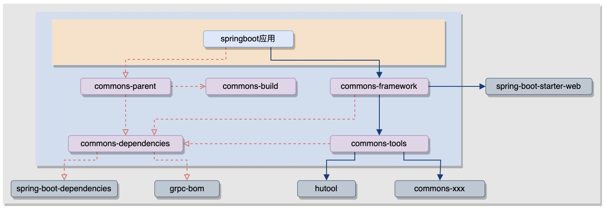

> @since 2.8.2

## 文档目的

希望在开发工作中，大家能够使用统一的风格，彼此形成一种默认的规范约定，减少后续不必要的沟通成本；


## 1. 工程结构

```txt 
{项目xx}-{服务xxx}
   ├─bin                                      ## 应用脚本（默认提供，可自定义覆盖）
   │  ├─env.properties
   │  ├─install.sh
   │  ├─run.sh
   │  └─setenv.sh
   ├─src
   │  └─main
   │     ├─java
   │     │  └─com.cowave.{项目名}.{服务名}      ## 代码目录
   │     │     ├─...
   │     │     └─Application.java
   │     │      
   │     └─resources
   │        ├─smart-doc.json                  ## 接口文档描述（约定使用smart-doc）
   │        ├─logback-spring.xml              ## 日志配置（默认提供，可自定义覆盖）
   │        ├─sql                             ## 数据库版本管理（约定使用liquibase）
   │        │  ├─changelog.yml
   │        │  ├─...
   │        ├─config                          ## 应用配置（约定yml配置文件都放到config目录中）
   │        │  ├─application.yml
   │        │  ├─dev
   │        │  │  ├─application.yml
   │        │  │  ├─...
   │        │  └─prod 
   │        │     ├─application.yml
   │        │     ├─...
   │        └─META-INF
   │           ├─common.yml                    ## 默认的配置项（可选）
   │           └─i18n                          ## 国际化资源
   │              ├─...
   │
   ├─docker.sh/tar.sh/deb.sh                   ## 构建脚本（默认提供，可自定义覆盖）
   ├─pom.xml
   └─README.md
```


### 1.1. pom.xml

- 坐标约定

```xml
<groupId>com.cowave.{项目}</groupId>
<artifactId>{项目}-{应用}</artifactId>
```


- parent约定：

如果是springboot应用，使用`commons-parent`作为parent

```xml
<parent>
    <groupId>com.cowave.commons</groupId>
    <artifactId>commons-parent</artifactId>
    <version>2.8.2</version>
</parent>
```

如果是组件依赖包，使用`commons-dependencies`作为parent

```xml
<parent>
    <groupId>com.cowave.commons</groupId>
    <artifactId>commons-dependencies</artifactId>
    <version>2.8.2</version>
</parent>
```


- dependency约定：

对于springboot项目应用，使用`commons-framework`作为依赖

```xml
<dependency>
    <groupId>com.cowave.commons</groupId>
    <artifactId>commons-framework</artifactId>
</dependency>
```


### 1.2. 打包构建(jar/tar/deb/docker)

针对springboot应用，在`commons-parent`中定义了四种打包方式：

- jar包

```tex
maven clean install -Dbuild=jar
```

springboot默认的打包方式，整个打成一个jar包，使用命令行自行启动；


- tar包

```tex
maven clean install -Dbuild=tar
```

针对Linux环境下的裸机安装，提供启动脚本，另外将config目录打在了jar包外面（方便手动修改）

构建行为定义在脚本tar.sh中（执行`maven compile`后，可以从target目录拷贝到工程根目录下进行修改覆盖）

默认安装后的内容包括：

```tex
{app_home}                               ## 默认：/opt/cowave/{app_name}
   ├─bin                                      
   │  ├─env.properties
   │  ├─run.sh
   │  └─setenv.sh
   ├─lib                                      
   │  └─{app_name}_{app_version}.jar
   └─config
   │  └─...
   └─log                                 ## 运行日志
      ├─boot.log
      ├─root.log
      └─access.log
```


- deb包

```tex
maven clean install -Dbuild=deb
```

针对ubuntu环境下的裸机安装，内容与tar包一致，只是添加了systemctl管理；

类似的，构建行为定义在脚本deb.sh中（执行`maven compile`后，可以从target目录拷贝到工程根目录下进行修改覆盖）


- docker镜像

```tex
maven clean install -Dbuild=docker
```

docker镜像的内容也与tar包一致

构建行为定义在脚本docker.sh中（执行`maven compile`后，可以从target目录拷贝到工程根目录下进行修改覆盖）


### 1.3. bin

bin目录是默认提供的一套脚本（同样，执行`maven compile`后，可以从target目录拷贝到工程根目录下进行修改覆盖）


#### env.properties

环境变量设置（应用启动时读取生效，如果对应环境变量已经存在，则使用已经存在的环境变量值）

默认有下面配置（具体解释可见注释，不再赘述）：

```properties
####################################################################### Jvm
#### java环境（默认取环境变量，这里可以覆盖）
java_home=
#### 应用启动参数
jvm_option=-Xms256m -Xmx256m -XX:MetaspaceSize=128m -XX:+HeapDumpOnOutOfMemoryError
#### jvm参数：JMX端口
#jvm_option=-Djava.rmi.server.hostname=0.0.0.0
#jvm_option=-Dcom.sun.management.jmxremote
#jvm_option=-Dcom.sun.management.jmxremote.port=29999
#jvm_option=-Dcom.sun.management.jmxremote.ssl=false
#jvm_option=-Dcom.sun.management.jmxremote.authenticate=false
#### jvm参数：debug端口
#jvm_option=-agentlib:jdwp=transport=dt_socket,server=y,suspend=n,address=0.0.0.0:19999
#### 启用加密包Agent(on/off)
java_agent=off

####################################################################### App
## 应用端口（HTTP)，tar包和deb包启动时检测，docker忽略
app_port=8080
## 应用目录（默认放在/opt/cowave/，这里可以覆盖）
app_home=
## 应用名称（默认取pom.xml，这里可以覆盖）
app_name=
## 应用版本（默认取pom.xml，这里可以覆盖）
app_version=
```

好处是让开发可以将应用需要的配置项统一提取到env.properties中，让运维工程人员不再需要关心具体的配置文件；


#### setenv.sh

setenv.sh中定义了一些方法行为，可以修改覆盖来改变安装或启动的行为，比如：

```tex
修改config()方法，可以在启动前做一些操作，比如根据环境变量（包含env.properties中的定义），来修改配置文件；

修改install_copy()方法，可以修改tar包安装时所拷贝的文件；
```


#### run.sh

启动脚本run.sh固定不需要修改，提供了一些常用方法：

```tex
./run.sh version    ## 打印应用版本
./run.sh status     ## 打印应用状态
./run.sh config     ## 重新应用配置（比如修改了setenv.sh的config()方法，可以根据环境变量重新修改配置文件）
./run.sh start      ## 启动应用（会尝试检测Http端口判断是否启动成功，端口见上面说明在env.properties中定义）
./run.sh stop       ## 停止应用
./run.sh restart    ## 重新启动（stop然后start）
./run.sh up         ## 容器中启动使用
```


说明一下默认的启动参数：

```toml
jvm_option="$jvm_option -Duser.dir=$app_home -Dspring.config.location=$app_home/config/"

如果检测到${app_home}/config/prod 目录，则追加参数
jvm_option="$jvm_option -Dspring.profiles.active=prod"

如果java_agent设置为on（jar包加密），则追加参数
jvm_option="$jvm_option -javaagent:$app_home/lib/$app_name-$app_version.jar"
```


#### install.sh

tar包的安装脚本，固定不需要修改


### 1.4. src/main/resources/config

配置文件的**格式约定：.yml**；

配置文件的**目录约定：/resources/config**；

如果启用profile，那么约定以dev和prod两个子目录进行区分，然后在`resources/config/application.yml`中引用，比如：

```yaml
## 避免单个配置文件中的配置过多而显得臃肿，建议使用多个文件来对不同领域的配置进行划分；
spring:
  config:
    activate:
      on-profile: dev
    import:
      - dev\application.yml     
      - dev\application-datasource.yml
      - dev\application-kafka.yml
      - dev\application-redis.yml
---
spring:
  config:
    activate:
      on-profile: prod
    import:
      - prod\application.yml
      - prod\application-datasource.yml
      - prod\application-kafka.yml
      - prod\application-redis.yml
```


### 1.5. src/main/resources/logback-spring.xml

commons-framework中默认对日志进行了配置（也可以自定义logback-spring.xml，进行覆盖）

默认会打印三个日志文件：

```tex
access.log  ## Restful接口日志，包括请求、响应、以及处理过程；
root.log    ## 根日志，除去access之外的其它日志；
boot.log    ## 控制台日志（docker启动不会打印）
```


### 1.6. src/main/resources/sql

对于应用数据库的版本管理，约定使用liquibase（启动时检查更新数据库，不需要运维人工干预）

约定配置（需要引入maven依赖）：

```yaml
spring:
  liquibase:
    enabled: true
    change-log: sql/changelog.yml
```

参考示例：https://gitlab.cowave.com/java/sys/-/blob/master/sys-admin/src/main/resources/sql/changelog.yml


### 1.7. src/main/resources/smart-doc.json

对于Restful接口文档，约定使用smart-doc，基于注释进行生成；

参考示例：https://gitlab.cowave.com/java/sys/-/blob/master/sys-admin/src/main/resources/smart-doc.json


### 1.8. src/main/resources/META-INF/common.yml

目的是让config下的配置文件显得更精简一点；

对于一些基本不用修改，但又需要显式配置的配置项，可以放到common.yml中，commons-framework会在应用启动时尝试加载；


### 1.9. src/main/resources/META-INF/i18n

国际化资源文件目录，commons-framework默认会尝试加载`META-INF/i18n/messages`，如果不是可以修改掉默认配置

```yaml
spring:
  messages:
    basename: META-INF/i18n/messages
```


### 1.10. src/main/java

对于代码package结构，不做过多的要求限制，推荐两种常用的结构：

- mvc

如果项目结构比较简单清晰，可以简单沿用mvc的controller/service/mapper/entity来进行分包。如果想避免service层之间相互引用，可以在service与mapper之间再加一层manage，来作为service层中的公用处理。

考虑到可能还有一些其他的package定义，比如util或者configuration之类，可以在mvc之上加一层api，与启动类保持同级。这样包结构看起来会更有层次一些，而且也对应我们的接口定义习惯: `http://{ip}:{port}/{cotext-path}/api/v1/xxx`，


- ddd

在微服务项目中，一般多个服务之间会存在存在相互调用，依赖彼此的接口。对于这些Rpc接口的调用应该由提供方来定义，然后给各个调用方来作为依赖。而不应该在各个调用的服务中定义，容易造成重复和混乱（也不绝对，如果服务间的调用比较简单清晰，直接在调用方定义就行）。所以一般会将代码拆成不同的module：

```txt 
{项目xx}-{服务xxx}
   ├─xxx-api       ## 依赖xxx-core，对应controller层接口和service层的业务处理
   ├─xxx-core      ## 依赖xxx-model，对应持久层、缓存、或消息中间件的处理，比如数据库mapper，redis或kafka之类的调用处理
   ├─xxx-model     ## 应用模型定义，独立处理是考虑到remote与api可能存在共用的模型定义，如果不存在，那么也可以合并到core中
   ├─xxx-remote    ## 对外提供的Rpc接口，如果复用模型定义，可以依赖xxx-model，也可以使用门面模式单独定义接口的输入输出模型
   ├─xxx-starter   ## 依赖xxx-api，定义启动类及一些配置，独立出来是考虑到可能存在将多个springboot应用合并成一个程序启动的场景
   └─pom.xml
```


### 1.11. src/test

单元测试很多时候都需要依赖一些环境，比如各种数据库存储或消息中间件。推荐使用 [testcontainers](https://java.testcontainers.org) ，它会基于docker拉起一个测试环境，并负责管理容器的生命周期，这样如果再使用liquibase管理数据库，那么每次测试都可以从零初始化一个环境。

对于外部服务的Feign调用，可以手动创建接口实例，并声明为`@Primary`，这样就能在测试中构造接口响应了。

参考示例：https://gitlab.cowave.com/java/sys/-/blob/master/sys-admin


## 附录：commons包说明



- commons-dependencies

针对maven工程，定义了一下常用的依赖个插件版本；

比如对代码检查定义了maven-pmd-plugin，默认会在编译之前检查代码规范，有的场景中可能不得不违背一些规范，那么对于这些文件，可以进行排除（也可以设置skip.pmd，但是不建议）

```xml
<build>
    <plugins>
        <plugin>
            <groupId>org.apache.maven.plugins</groupId>
            <artifactId>maven-pmd-plugin</artifactId>
            <configuration>
                <excludes>
                    <exclude>**/access/AccessLogger.java</exclude>
                </excludes>
            </configuration>
        </plugin>
    </plugins>
</build>
```

- commons-parent

针对springboot应用，定义了一些插件及打包方式；比如打jar包排除哪些文件；

- commons-build

构建脚本定义，在maven构建开始时会拷贝到对应工程的target目录下；

- commons-tools

一些常用的java工具类归类收集；

- commons-framework

针对springboot-web应用的一个通用依赖，具体内容可以见《Java开发文档》；
