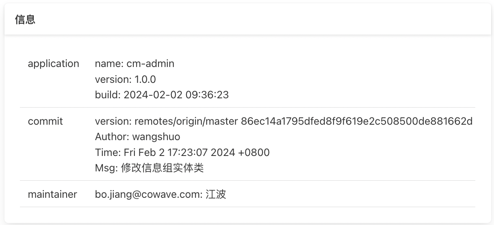

## 文档目的

此文档主要说明下我们在开发中的一些约定，介绍下commons-framework中做了哪些工作。限于个人水平和精力，虽然已经付出了不少时间，难免还有一些不足或问题。如果有好的想法或意见，可以提出来进行改正。


## 1. 请求处理

### 1.1. 请求信息 Access

针对Controller请求（约定Controller类命名统一以Controller结尾），我们使用Access封装了一些请求信息，并提供一套静态接口，方便在处理过程中获取，比如以下接口：

```java
Access.language();    // 国际化语言
Access.ip();          // 请求ip
Access.id();          // 请求id
Access.url();         // 请求url
Access.time();        // 请求时间
Access.pageIndex();   // 分页参数 page
Access.pageSize();    // 分页参数 pageSize
Access.pageOffset();  // 分页offset
Access.accessToken();      // AccessToken实例
Access.token();            // JWT Token
Access.userId();           // 用户id
Access.userCode();         // 用户编码
Access.userAccount();      // 用户账号
Access.userName();         // 用户名称
Access.isAdmin();          // 是否系统管理员
Access.userRoles();        // 用户角色列表
Access.userPermissions();  // 操作权限列表
Access.deptId();           // 部门id
Access.deptCode();         // 部门编码
Access.deptName();         // 部门名称
Access.clusterId();        // 集群id
Access.clusterLevel();     // 集群等级
Access.clusterName();      // 集群名称
```


### 1.2. 异常处理 AccessAdvice

针对Controller请求，AccessAdvice会在返回时统一处理异常，根据类型分别进行不同的提示（支持国际化），默认进行如下转换：

```
HttpRequestMethodNotSupportedException   ## 不支持的请求方法
HttpMessageConversionException           ## 请求参数转换失败
AccessDeniedException                    ## 没有访问权限
IllegalArgumentException                 ## 非法参数:{0}
SQLException                             ## 数据操作失败
DuplicateKeyException                    ## 数据主键冲突
DataAccessException                      ## 数据访问失败
Exception                                ## 系统错误
BindException                            ## 获取Validation注解内容
ConstraintViolationException             ## 获取Validation注解内容
MethodArgumentNotValidException          ## 获取Validation注解内容
AssertsException                         ## 获取异常msg
```

- AssertsException自定义提示

通过抛出AssertsException可以自定义异常提示，所以如果需要定义一些自己的异常类型（一般并不需要，尽量使用已知的约定异常），并指定输出提示，请继承AssertsException。

对应的为了方便，我们也提供了一套断言接口（失败抛出AssertsException），并支持国际化。

```java
Asserts.isTrue(boolean expression, String message, Object... args);
Asserts.isFalse(boolean expression, String message, Object... args);
Asserts.notEquals(Object a, Object b, String message, Object... args);
Asserts.equals(Object a, Object b, String message, Object... args);
Asserts.notBlank(@Nullable String text, String message, Object... args);
Asserts.isBlank(@Nullable String text, String message, Object... args);
Asserts.notNull(@Nullable Object object, String message, Object... args);
Asserts.isNull(@Nullable Object object, String message, Object... args);
Asserts.notEmpty(@Nullable Map<?, ?> map, String message, Object... args);
Asserts.isEmpty(@Nullable Map<?, ?> map, String message, Object... args);
Asserts.notEmpty(@Nullable Collection<?> collection, String message, Object... args);
Asserts.isEmpty(@Nullable Collection<?> collection, String message, Object... args);
Asserts.notEmpty(@Nullable Object[] array, String message, Object... args);
Asserts.isEmpty(@Nullable Object[] array, String message, Object... args);
```


### 1.3. 国际化处理 Accept-Language

对于国际化参数，我们在Http Header中使用Accept-Language来传递，默认取值为：Locale.getDefault()

- 国际化开关

```yaml
spring:
  messages:
    enable: false  ## （默认关闭）
```

- 国际化资源

对于国际化资源，我们约定为：`META-INF/i18n/messages`，不过在配置时注意需要带上`commons-framework`定义的资源（framework中定义的国际化资源key统一是以frame作为的前缀）

```yaml
spring:
  messages:
    basename: META-INF/i18n/messages,META-INF/i18n/messages-frame
```

- 国际化操作

对于国际化翻译，我们定义了`MessageHelper`，直接注入就行

```java
//MessageHelper
public String msg(String key, Object... args);
```

- 国际化异常

如果是抛出AssertsException，那么需要将message设置为国际化的key，然后可以通过args追加参数，比如：

```java
throw new AssertsException("frame.file.invalid").args(name);
```

对应的如果是使用Asserts断言，就将message设置为国际化的key；

```java
Asserts.notNull(user.getAccount(), "user.notnull.account", id);
```

如果是Validation注解声明的校验，需要将注解的message定义为国际化key，但是这里无法传入参数来替换国际化中的占位符，比如：

```java
@NotBlank(message = "user.notnull.name")
private String userName;

@NotBlank(message = "user.notnull.account")
private String userAccount;
```


### 1.4. 响应结构 Response

针对Controller响应，我们约定了如下的结构

- 一般响应结构：

| 字段      | 类型   | 必填 | 含义     |
| --------- | ------ | ---- | -------- |
| requestId | string | 是   | 请求Id   |
| code      | int    | 是   | 响应码   |
| msg       | string | 否   | 响应描述 |
| cause     | string | 否   | 错误原因 |
| data      | Object | 否   | 响应数据 |

- 分页响应结构：

对于分页请求参数，我们统一约定为：`page`和`pageSize`

| 字段       |       | 类型    | 必填 | 含义     |
| --------- | ----- | ------ | ---- | -------- |
| requestId |       | string | 是   | 请求Id    |
| code      |       | int    | 是   | 响应码    |
| msg       |       | string | 否   | 响应描述  |
| cause     |       | string | 否   | 错误原因  |
| data      | total | int    | 是   | 总数      |
|           | list  | array  | 是   | 对象列表   |

对应的，我们提供了一套Response静态构造器：

```java
Response.success();                                    // 200
Response.success(V data);                              // 200 Response<V>
Response.success(String msg, V data);                  // 200 Response<V>
Response.error();                                      // 500
Response.error(String msg);                            // 500
Response.error(ResponseCode responseCode);             // code(200,202,400,401,403,429,498,500,597)
Response.error(ResponseCode responseCode, String msg); // code
Response.page(List<E> list);                           // 200 Response<Page<E>>
```

这样在Controller中，我们就可以尽量保证代码简洁，比如：

```java
@RequiredArgsConstructor
@Validated
@RestController
@RequestMapping("/api/v1/user")
public class SysUserController {

    @PostMapping("/list")
    public Response<Response.Page<SysUser>> list(@RequestBody SysUser sysUser) {
        return Response.page(sysUserService.list(sysUser));
    }
    
    @GetMapping(value = {"/info/{userId}"})
    public Response<SysUser> info(@PathVariable Long userId) {
        return Response.success(sysUserService.info(userId));
    }
}
```


### 1.5. 请求鉴权 Authorization

鉴权是基于spring-security实现，依赖需要自己声明：

```xml
<dependency>
    <groupId>org.springframework.boot</groupId>
    <artifactId>spring-boot-starter-security</artifactId>
</dependency>
<dependency>
    <groupId>io.jsonwebtoken</groupId>
    <artifactId>jjwt</artifactId>
</dependency>
```

- 配置（默认）

```yaml
spring:
  application:
    token:
      header: Authorization
      salt: admin@cowave.com    ## 认证秘钥，要与Token发放服务保持一致，否则无法通过；
      conflict: false           ## 是否检测登录冲突，后面的登录会使之前登录获取的Token失效；
      clientExpire: 360         ## 客户端Token超时
      serverExpire: 3600        ## 服务端Token超时
      systemExpire: 60          ## 后台应用的Token超时
      ignoreUrls:               ## 忽略鉴权的url
        - /api/v1/auth/login
        - /api/v1/auth/register
```

对于Token鉴权的流程设计如下（关键的配置就是鉴权服务与资源服务之间约定的加密salt）


- 定义

如果引入了security依赖，默认会对所有的请求进行鉴权，如下可以对鉴权行为进行一些自定义设置

```java
@EnableGlobalMethodSecurity(prePostEnabled = true, securedEnabled = true)
@RequiredArgsConstructor
public class SecurityConfiguration {
    
    private final TokenConfiguration tokenConfiguration;

    private final TokenService tokenService;

    private String[] permitAll(){
        // tokenConfiguration.getIgnoreUrls()，以及一些预定义的忽略鉴权的url
    }

    @Bean
    public SecurityFilterChain securityFilterChain(HttpSecurity httpSecurity) throws Exception {
        httpSecurity.csrf().disable();
        httpSecurity.sessionManagement().sessionCreationPolicy(SessionCreationPolicy.STATELESS);
        httpSecurity.headers().frameOptions().disable();
        httpSecurity.authorizeRequests().antMatchers(permitAll()).permitAll().anyRequest().authenticated();
        TokenAuthenticationFilter tokenAuthenticationFilter = new TokenAuthenticationFilter(tokenService, permitAll());
        httpSecurity.addFilterBefore(tokenAuthenticationFilter, UsernamePasswordAuthenticationFilter.class);
        return httpSecurity.build();
    }

    // 对于permitAll的url，如果携带了Token，spring-security仍然会校验Token，如下声明可以彻底忽略掉鉴权校验
    @Bean
    public WebSecurityCustomizer webSecurityCustomizer(){
        return (web) -> web.ignoring().antMatchers(permitAll());
    }
}
```

- 接口权限

以上讨论的都是访问鉴权，就是要求用户在访问之前先进行登录。然后在登录的基础上，还可以限制用户的操作权限，以下是我们提供的一个permit鉴权实例

```java
public boolean isAdmin();                     // 是否管理员
public boolean hasRole(String role);          // 是否拥有角色
public boolean hasPermit(String permission);  // 是否拥有权限/菜单
public boolean isCurrentCluster();            // 是否登录的当前集群
```

这样就可以通过`@PreAuthorize`对接口操作进行一些鉴权判断了

```java
@PreAuthorize("@permit.hasRole('sysAdmin')")
@GetMapping("/list")
public Response<Page<SysConfig>> list(SysConfig config){
   return Response.page(configService.selectConfigList(config));
}
```

## 2. 数据库操作

### 2.1. 依赖声明

对于spring应用如果需要进行数据库操作，那么需要引入对应的数据库驱动，以及spring-jdbc依赖，：

```xml
<dependency>
    <groupId>org.springframework.boot</groupId>
    <artifactId>spring-boot-starter-jdbc</artifactId>
</dependency>
```

- mybatis

不过一般我们都是基于mybatis进行操作的，所以只需要引入mybatis，就间接引入了jdbc依赖

```xml
<dependency>
    <groupId>org.mybatis.spring.boot</groupId>
    <artifactId>mybatis-spring-boot-starter</artifactId>
</dependency>
```

- pageHelper

也可以引入pageHelper，其对mybatis分页操作进行了简化，只要检测到请求参数中传入了`page`和`pageSize`，就会自动进行分页查询

```xml
<dependency>
    <groupId>com.github.pagehelper</groupId>
    <artifactId>pagehelper-spring-boot-starter</artifactId>
</dependency>
```

这样我们在Controller中进行分页查询时，就可以简洁如下（Response.page会自动获取到list和count）：

```java
@PostMapping("/list")
public Response<Response.Page<SysUser>> list(@RequestBody SysUser sysUser) {
    return Response.page(sysUserService.list(sysUser));
}
```

- mybatis-plus

如果引入mybatis-plus，可以进一步简化sql操作，对于其分页操作，我们也声明了MybatisPlusInterceptor，可以使用PageDO来传递分页参数和接收返回结果

```xml
<dependency>
    <groupId>com.baomidou</groupId>
    <artifactId>mybatis-plus-boot-starter</artifactId>
</dependency>
```


### 2.2. 多数据源配置

对于单个数据源，按照默认的配置就行；如果有多个数据源，那么可以如下配置dynamic：（要求有且仅有一个primary数据源）

```yaml
spring:
  datasource:
    dynamic:
      primary:
        driverClassName: com.oscar.Driver
        url: jdbc:oscar://10.64.193.52:2003/osrdb
        username: db_xx1
        password: 12345678
      db_xx2:，
        driverClassName: com.oscar.Driver
        url: jdbc:oscar://10.64.193.52:2003/osrdb
        username: db_xx2
        password: 12345678
```

默认都是对primary数据源进行操作，如果想对指定的数据源进行操作，可以如下方式指定（目前不支持跨数据源的事务）：

```java
@DataSource("db_xx2")
public SysConfig selectConfigById(Long configId){
    return configMapper.selectConfig(config);
}
```

spring默认使用的数据源是HikariDataSource，当然也可以使用阿里的DruidDataSource，多数据源也作了支持

```xml
<dependency>
    <groupId>com.alibaba</groupId> 
    <artifactId>druid-spring-boot-starter</artifactId>
</dependency>
```


### 2.3. 数据库方言兼容

可能存在这样的场景：同一个应用需要兼容不同数据库的sql，那么可以使用mybatis提供的databaseId来标记区分，

```xml
<update id="updateTransponderUsage" databaseId="mysql">
    ...   
</update>

<update id="updateUpBeamUsage" databaseId="postgres">
    ...
</update>
```

我们提供了DatabaseIdProvider实现，目前支持以下4种系列的数据库支持

```java
// DB_PRODUCT.put("OSCAR", "oscar");
// DB_PRODUCT.put("MySQL", "mysql");
// DB_PRODUCT.put("Oracle", "oracle");
// DB_PRODUCT.put("PostgreSQL", "postgres");
        
@Override
public String getDatabaseId(DataSource dataSource) throws SQLException {
    try(Connection connection = dataSource.getConnection()){
        String product = connection.getMetaData().getDatabaseProductName();
        return DB_PRODUCT.get(product);
    }
}
```


### 2.4. 数据库版本管理

对于业务数据库的版本，我们统一要求使用liquibase来进行管理，方便以增量的形式来升级应用数据库，需要自行声明依赖：

```xml
<dependency>
    <groupId>org.liquibase</groupId>
    <artifactId>liquibase-core</artifactId>
</dependency>
```

- 配置

对于changelog.yml的文件路径，我们统一约定如下配置：

```yaml
spring:
  liquibase:
    enabled: true
    change-log: sql/changelog.yml
```

至于changelog.yml中的具体配置，可以参考示例：https://gitlab.cowave.com/commons/demo/demo-sys/sys-admin/-/blob/master/src/main/resources/sql/changelog.yml


## 3. Redis操作

需要声明依赖：

```xml
<dependency>
    <groupId>org.springframework.boot</groupId>
    <artifactId>spring-boot-starter-data-redis</artifactId>
</dependency>
```

- 配置

对于单个Redis环境，按照默认配置就行。如果有两套环境，可以用private和public来区分（public实例在注入时需要指定名称）

```yaml
spring:
  redis:
    private:
      host: 192.168.141.13
      port: 6379
    public:
      host: 192.168.141.13
      port: 6389
```

- 操作

可以直接注入RedisTemplate进行操作，不过我们也提供了RedisHelper（方便对象序列化操作）， 比如以下操作：

```java
redisHelper.ping();
redisHelper.info();
redisHelper.keys(final String pattern);                                          // Collection<String>
redisHelper.getValue(final String key);                                          // <T>
redisHelper.putValue(final String key, final T value);
redisHelper.putExpireValue(final String key, final T value, final Integer timeout, final TimeUnit timeUnit);

redisHelper.getMap(final String key);                                            // Map<String, T>
redisHelper.getMapValue(final String key, final String hKey);                    // <T>
redisHelper.getMultiMapValue(final String key, final Collection<Object> hKeys);  // List<T>
redisHelper.putMapValue(final String key, final String hKey, final T value);
redisHelper.putMapAll(final String key, final Map<String, T> dataMap);
redisHelper.deleteMapValue(final String key, final String hKey);

redisHelper.expire(final String key, final long timeout);                        // TimeUnit.SECONDS
redisHelper.expire(final String key, final long timeout, final TimeUnit unit);
redisHelper.delete(final String key);
redisHelper.delete(final Collection<?> collection);

redisHelper.getList(final String key);                                           // range(key, 0, -1)
redisHelper.pushList(final String key, final List<T> dataList);                  // rightPushAll

redisHelper.getSet(final String key);                                            // Set<T>
redisHelper.putSet(final String key, final Set<T> dataSet);
redisHelper.putSet(final String key, final T value);
```


## 4. 字典操作

在Redis的基础上，我们定义了一套字典操作。framework中提供一个字典接口Dict，和一组字典缓存操作DictHelper。

具体的字典实现可以参考：《sys-admin通用管理系统设计：字典信息》

- 字典接口 Dict

字典的具体字段交给应用自由定义，但是要能提供以下信息：

```java
public interface Dict {
    String getGroupCode();  // 字典分组
    String getTypeCode();   // 字典类型
    String getDictCode();   // 字典码
    String getDictLabel();  // 字典名称
    Object getDictValue();  // 字典值
    Integer getDictOrder(); // 字典排序
}
```

- 缓存操作 DictHelper

```java
private static final String KEY_DICT = "sys-dict:dict:";
private static final String KEY_TYPE = "sys-dict:type:";
private static final String KEY_GROUP = "sys-dict:group:";
    
public void clear() {
public void put(Dict dict) {
public <T extends Dict> List<T> getGroup(String groupCode) {
public <T extends Dict> List<T> getType(String typeCode) {
public <T extends Dict> T getDict(String dictCode) {
public String getDictLabel(String dictCode) {
public <T> T getDictValue(String dictCode) {
public void removeDict(String dictCode) {
public void removeType(String typeCode) {
public void removeGroup(String groupCode) {
```


## 5. Kafka操作

需要声明依赖：

```xml
<dependency>
    <groupId>org.springframework.kafka</groupId>
    <artifactId>spring-kafka</artifactId>
</dependency>
```

- 配置

对于单个Kafka环境，按照默认配置就行。如果有两套环境，同样使用private和public区分（public实例在注入时需要指定名称）

```yaml
spring:
  kafka:
    private:
      bootstrap-servers: 127.0.0.1:9092,127.0.0.1:9093,127.0.0.1:9094
      ...
    public:
      bootstrap-servers: 127.0.0.1:9192,127.0.0.1:9193,127.0.0.1:9194
      ...
```

- 操作

如果是作为produce发送消息，那么可以使用KafkaTemplate

```java
@Resource(name = "publicKafkaTemplate")
private KafkaTemplate<String, Object> publicKafkaTemplate;
```

如果是作为consumer接收消息，可以使用KafkaListener

```java
@KafkaListener(topics = "testTopic", containerFactory = "publicKafkaListenerContainerFactory")
public void consume(ConsumerRecord<?, ?> record) {
    // ...
}
```


## 6. 系统告警

对于告警处理，我们只提供了一组接口

- 类型接口 Alarm

这里只是一个标记接口，用来标记告警类型，没有做任何限制

- 处理接口 AlarmAccepter

用来接收处理Alarm告警，比如存储到数据库或者通过消息队列传输。默认提供了一个KafkaAccepter（如果引入了kafka依赖的话），对应的配置如下：

```yaml
spring:
  application:
    alarm:
      kafka-enable: true
      kafka-topic: sys-alarm
```

- 请求异常告警工厂接口：AccessAlarmFactory

通过上面两个接口，我们可以将定义的告警声明为Alarm类型，然后通过AlarmAccepter来接收。不过Alarm的构造过程需要自己定义，其中对于Access请求异常是在framework中拦截的，不过它并不确定我们是否要对此产生告警，所以只能给一个接口

```java
public interface AccessAlarmFactory<T extends Alarm> {

    T newAccessAlarm(Response<Void> errorResp);
}
```


## 7. 操作日志

对于操作日志，我们也提供了一组接口，相关的实现可以参考：[《sys-admin通用管理系统设计：操作日志》](https://gitlab.cowave.com/commons/commons-doc/-/blob/main/Admin%E9%80%9A%E7%94%A8%E7%AE%A1%E7%90%86%E7%B3%BB%E7%BB%9F%E8%AE%BE%E8%AE%A1.md#user-content-%E6%93%8D%E4%BD%9C%E6%97%A5%E5%BF%97)

- 日志接口 OperationLog

操作日志的具体字段交给应用自由定义，但是要能能提供以下信息：

```java
public interface OperationLog {
    void initialize();                     // 日志初始化
    void setTypeCode(String typeCode);     // 日志类型
    void setActionCode(String actionCode); // 日志动作
    void setLogStatus(Integer logStatus);  // 日志状态
    void setLogDesc(String logDesc);       // 日志描述
    void setRequest(Map<String, Object> request); // 设置请求内容
    void setResponse(Object response);            // 设置响应内容
    Object getResponse();                         // 获取响应内容
    void putContent(String key, Object obj);      // 设置日志内容 key-value
}
```

- 处理接口 OperationAccepter

同样用来接收处理操作日志，默认提供了一个KafkaAccepter（如果引入了kafka依赖的话），对应的默认配置如下：

```yaml
spring:
  application:
    oplog:
      kafka-enable: true
      kafka-topic: sys-alarm
```

然后我们可以如下创建操作日志，以及进行处理

```java
SysLog sysLog = new SysLog();     // OperationLog的实现
sysLog.initialize();              // 初始化内容
// 其它信息赋值
operationAccepter.accept(sysLog); // 注入OperationAccepter，接收处理
```

- 标记注解 @Operation

为了方便日志记录，我们也提供了一个注解，但是**如果使用了@Operation，就要求必须提供一个OperationLog实现**。以下是sys-admin中的示例：

```java
@Operation(group = "sys-admin", type = "admin_user", desc = "新增用户：#{sysUser.userName}", content = Content.REQ)
@PostMapping("/add")
public Response<Void> add(@Validated @RequestBody SysUser sysUser) {
    sysUserService.add(sysUser);
    return Response.success();
}

@Operation(group = "sys-admin", type = "admin_user", desc = "修改用户：#{sysUser.userName}", content = Content.ALL)
@PostMapping("/edit")
public Response<SysUser> edit(@Validated @RequestBody SysUser sysUser) {
    return Response.success(sysUserService.edit(sysUser));
}

@Operation(group = "sys-admin", type = "admin_user", desc = "删除用户：#{resp.userName}", content = Content.RESP)
@GetMapping(value = {"/delete"})
public Response<SysUser> delete(@NotNull(message = "valid.notnull.user.id") Long userId) {
    return Response.success(sysUserService.delete(userId));
}
```

对于desc提供了简单的spel能力，可以通过`#{}`的方式获取参数(同名)以及响应(resp)中的一些信息；

对于content，可以选择保存请求或者响应，这里有点麻烦的是对于删除和编辑的场景，如果保存删除内容，只能从返回中获取；

也可以手动对日志内容进行一些调整，所以提供了下面接口（日志构造之后其实就放在ThreadLocal中）

```java
public interface OperationHandler {
	void pareseRequestContent(Method method, Map<String, Object> args, OperationLog log);
	void pareseResponseContent(Method method, Object resp, OperationLog log);
	void pareseExceptionContent(Method method, Exception e, OperationLog log);
}
```


## 8. 文件操作

对于常见的文件操作，比如上传下载删除等，我们提供了FileService。相关的实现可以参考：《sys-admin通用管理系统设计：附件信息》


### 8.1. 本地操作

```java
/**
  * 上传本地文件
  * @param multipartFile 上传文件
  * @param dirPath       本地目录
  */
public String localUpload(MultipartFile multipartFile, String dirPath) throws Exception;

/**
  * 下载本地文件
  * @param filename 文件名称
  * @param filePath 本地路径
  */
public void localDownload(HttpServletResponse resp, String filename, String filePath) throws IOException;
```


### 8.2. minio操作

需要声明依赖：

```xml
<dependency>
    <groupId>io.minio</groupId>
    <artifactId>minio</artifactId>
</dependency>
```

- 配置

```yaml
spring:
  minio:
    endpoint: http://127.0.0.1:9000
    accessKey: admin
    secretKey: admin123
    bucket: sys-admin
```

- 操作

```java
// 上传Minio文件
public void minioUpload(MultipartFile multipartFile, String bucket, String filePath, boolean isPublic) throws Exception;

// 下载Minio文件
public void minioDownload(HttpServletResponse resp, String bucket, String filePath, String fileName) throws Exception;

// 预览Minio文件
public String minioPreview(String bucket, String filePath) throws Exception;

// 删除Minio文件
public void minioDelete(String bucket, String filePath) throws Exception;

// minio获取InputStream
public InputStream minioInputStream(String bucket, String filePath) throws Exception;

// bucket下面多个文件打包成tgz下载
public void minioDownloadTgz(HttpServletResponse resp, String bucket, Map<String, String> filePathMap, String fileName) throws Exception;
```


## 9. Excel操作 easy-excel

对于Excel操作，我们统一使用easy-excel，需要自己声明依赖

```xml
<dependency>
    <groupId>com.alibaba</groupId>
    <artifactId>easyexcel</artifactId>
</dependency>
```


## 10. Elasticsearch操作 easy-es

对于Elasticsearch操作，我们统一使用easy-es，需要自己声明依赖

```xml
<dependency>
    <groupId>org.dromara.easy-es</groupId>
    <artifactId>easy-es-boot-starter</artifactId>
</dependency>
```


## 11. 异步任务 @Async / 线程池

- 注解 @Async

  对于请求过程中的一般异步处理，直接通过Spring注解比较方便（对应的线程池属性修改springboot约定的配置就行）

  ```java
  @Async
  public void test() {
      remoteTestService.test();
  }
  ```

  

- 注入 Executor

  **《不要自己创建Thread或者Executor实例》**

  springboot中默认有一个线程池实例，请优先复用已有的线程池实例

  ```java
  @Slf4j
  @RequiredArgsConstructor
  @Component
  public class DemoExecutor {
  
      private final ThreadPoolExecutor executor;
  
      public void exec(){
          executor.execute(() -> log.info(DateUtils.format("HH:mm:ss")));
      }
  }
  ```

  如果确实需要使用多个线程池实例，请统一使用dynamic-tp进行创建管理，默认已经引入了依赖，关于配置可以相关文档

  ```yaml
  spring:
    dynamic:
      tp:
        enabled: true                               # 是否启用 dynamictp，默认true
        enabledCollect: true                        # 是否开启监控指标采集，默认true
        executors:                               # 动态线程池配置，都有默认值，采用默认值的可以不配置该项，减少配置量
          - threadPoolName: dtpExecutor1         # 线程池名称，必填
            threadPoolAliasName: 测试线程池        # 线程池别名，可选
            executorType: common                 # 线程池类型 common、eager、ordered、scheduled、priority
            corePoolSize: 6                      # 核心线程数，默认1
            maximumPoolSize: 8                   # 最大线程数，默认cpu核数
            queueCapacity: 2000                  # 队列容量，默认1024
            queueType: VariableLinkedBlockingQueue         # 任务队列，默认VariableLinkedBlockingQueue
            rejectedHandlerType: CallerRunsPolicy          # 拒绝策略，查看RejectedTypeEnum枚举类，默认AbortPolicy
            keepAliveTime: 60                              # 空闲线程等待超时时间，默认60
            threadNamePrefix: test                         # 线程名前缀，默认dtp
            allowCoreThreadTimeOut: false                  # 是否允许核心线程池超时，默认false
            waitForTasksToCompleteOnShutdown: true         # 参考spring线程池设计，优雅关闭线程池，默认true
            awaitTerminationSeconds: 5                     # 关闭线程池时，阻塞等待线程池中任务执行时间，默认3s
            preStartAllCoreThreads: false                  # 是否预热所有核心线程，默认false
            runTimeout: 200                                # 任务执行超时阈值，单位（ms），默认0（不统计）
            queueTimeout: 100                              # 任务在队列等待超时阈值，单位（ms），默认0（不统计）
            taskWrapperNames: ["ttl", "mdc"]               # 任务包装器名称，继承TaskWrapper接口
            notifyEnabled: true                            # 是否开启报警，默认true
  ```

  

## 12. 定时任务

### 12.1. spring-scheduled

spring-scheduled是默认提供的定时方式，比较常用，这里不用多赘述；


### 12.2. spring-fom

默认已经引入了依赖，相比spring-scheduled，做了一些应用场景的扩展，以及提供了一些运维监控上的能力，简单示例如下：

这里不做过多说明，详细内容可以见文档：https://gitlab.cowave.com/commons/tools/spring-fom/-/blob/master/README.md

```java
@Fom(fixedDelay = 30000, remark = "心跳")
public class HeartbeatScheduler {

	@Autowired
	private HeartbeatClient heartbeatClient;

	@Schedule
	public void heartbeat() {
		heartbeatClient.sendHeartbeat();
	}
}
```


## 13. 服务调用 spring-feign

对于Http服务调用，我们自定义了一个轻量级的调用工具 spring-feign，可以解决大多数的调用场景；

这里也不做过多说明，详细内容可以见文档：https://gitlab.cowave.com/commons/tools/spring-feign/-/blob/master/README.md


## 14. 服务注册

### 14.1 Eureka注册

需要声明依赖：

```xml
<dependency>
    <groupId>org.springframework.cloud</groupId>
    <artifactId>spring-cloud-starter-netflix-eureka-client</artifactId>
</dependency>
```

- 配置

```yaml
eureka:
  instance:
    prefer-ip-address: true
    instance-id: ${spring.cloud.client.ip-address}:${server.port}
    lease-renewal-interval-in-seconds: 30
    lease-expiration-duration-in-seconds: 90
    metadata-map:
      management.context-path: ${server.servlet.context-path}/actuator
  client:
    service-url:
      defaultZone: http://127.0.0.1:19001/eureka   ## Eureka服务的地址
    register-with-eureka: false   ## 是否注册到Eureka
    fetch-registry: false         ## 是否从Eureka拉取注册的服务信息
```

- 配置管理中心

Eureka本身并不提供配置管理功能，因此需要额外部署Apollo环境，然后应用需要声明相关依赖：

```xml
<dependency>
    <groupId>com.ctrip.framework.apollo</groupId>
    <artifactId>apollo-client</artifactId>
</dependency>
```

以及进行对应的配置：

```yaml
app:
  id: sys-admin     ## 应用Id

apollo:
  meta: http://127.0.0.1:19001
  cluster: default                    ## 应用集群，默认default
  cache-dir: ./apollo                 ## 本地缓存目录
  bootstrap:
    enabled: true
    namespaces: application,common    ## 命名空间，application是应用默认的私有命名空间
    eagerLoad:
      enabled: true                   ## 使Apollo的加载顺序放到日志系统加载之前
```


### 14.2 Nacos注册

需要声明依赖：

```xml
<dependency>
    <groupId>com.alibaba.cloud</groupId>
    <artifactId>spring-cloud-starter-alibaba-nacos-discovery</artifactId>
</dependency>
```

- 配置

```yaml
spring:
  cloud:
    nacos:
      discovery:
        server-addr: 10.64.4.96:8848
        metadata:
          management:
            context-path: ${server.servlet.context-path}/actuator
```

- 配置管理中心

nacos可以进行配置管理，但是依赖也需要自己声明（以下是nacos-discovery中可选的三个依赖）

```xml
<dependency>
    <groupId>org.springframework.cloud</groupId>
    <artifactId>spring-cloud-config-client</artifactId>
</dependency>
<dependency>
    <groupId>org.springframework.cloud</groupId>
    <artifactId>spring-cloud-config-server</artifactId>
</dependency>
<dependency>
    <groupId>org.springframework.cloud</groupId>
    <artifactId>spring-cloud-loadbalancer</artifactId>
</dependency>
```


## 15. 服务健康 spring-boot-admin

在Eureka或Nacos的服务中，我们集成了spring-boot-admin-server，所以访问：服务的http://{ip}:{port}/health可以看到所有注册的服务健康情况，对于常见的数据库/Redis/Kafka健康检查，我们进行一些重写，方便获取信息或定位问题。另外，对于info面板信息，我们也统一进行了编辑（如果使用我们约定的构建方式，服务脚本命令也可以获取：./run.sh version）



一般我们默认会放开所以Actuator端点，并忽略了Token校验，但是如果对于安全有比较高的要求，请根据实际情况调整

```yaml
management:
  info:
    env:
      enabled: true
  endpoints:
    web:
      exposure:
        include: '*'
  endpoint:
    health:
      show-details: ALWAYS
```


## 16. socket-io

java服务端的socketio依赖版本比较旧，这限制了前端vue所选择的socket-io版本

需要声明依赖：

```xml
<dependency>
	<groupId>com.corundumstudio.socketio</groupId>
	<artifactId>netty-socketio</artifactId>
</dependency>
```

- 配置

```yaml
spring:
  socket-io:
    host: 
    port: 19011
    maxFramePayloadLength: 1048576
    maxHttpContentLength: 1048576
    bossCount: 1
    workCount: 100
    allowCustomRequests: true
    upgradeTimeout: 1000000
    pingTimeout: 6000000
    pingInterval: 25000
```

- socket连接参数

如果应用启用了鉴权，那么要求客户端建立socket连接时，必须传参`Authorization`，否则拒绝；另外还要传递参数`userId`，服务会使用这个值来标记已经建立的连接；

- 服务发送消息

可以注入SocketServer，其提供了以下方法：

```java
public <T> void sendSingle(String event, T data, Long userId);         // 私聊
public <T> void sendGroup(String event, T data, List<Long> userIds);   // 群发
public <T> void sendAll(String event, T data);                         // 广播
```

- 接收客户端消息

实现下面接口，可以接收指定事件的消息

```java
public interface ClientMsgHandler {

    String getEvent();

    void onMsg(Long userId, String data);
}
```

- 连接事件

如果在客户端连接后，需要立即发送相关消息，可以实现接口

```java
public interface ConnectedHandler {

    void onConnected(Long userId, SocketServer socketServer);
}
```


## 17. 地理区域关系

区域覆盖在我们的产品中是一个比较常见的场景，比如判断波束是否覆盖了某一指定区域

需要声明相关依赖：

```xml
<dependency>
    <groupId>org.locationtech.jts</groupId>
    <artifactId>jts-core</artifactId>
</dependency>
<dependency>
    <groupId>org.osgeo</groupId>
    <artifactId>proj4j</artifactId>
</dependency>
<dependency>
    <groupId>com.vividsolutions</groupId>
    <artifactId>jts</artifactId>
</dependency>
```

在`GeometryHelper`中提供了一些常见区域判断的静态方法

```java
public static Geometry unionArea(List<GeoArea> list);                          // 联合区域
public static Geometry createGeometry(GeoArea geoArea);                        // 创建区域
public static Point createPoint(GeoPoint point);                               // 创建位置
public static Geometry createPolygon(List<GeoPoint> points, boolean original); // 创建多边形区域
public static Geometry createCircle(GeoPoint center);                          // 创建圆形区域
public static boolean containsPoint(GeoArea area, GeoPoint point);             // 区域是否包含位置
public static boolean containsArea(GeoArea src, GeoArea target);               // 区域是否包含区域
```


## 18. 关于Util工具类

不要随意定义各种util工具类，我们已经提供了commons-tools来归纳各种工具类，并引入了Hutool依赖，并且，请优先使用已有的Util！

如果定义新的Util工具，请注意依赖的声明方式，尽量设置成可选依赖，避免导致其它应用引入不必要的依赖！
