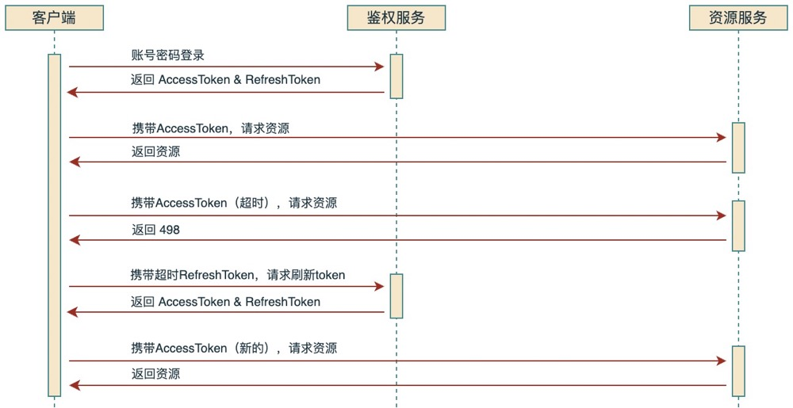

> @since 2.8.2

## 文档目的

主要介绍下commons-framework中做了哪些工作，以及在开发中的一些约定；

限于个人水平和精力，虽然付出了不少时间，但难免还有一些不足或问题，如有更好的想法或意见，可以提出来进行改进。


## 1. 请求处理

Access对应定义了一组默认配置，具体在下面遇到会进行说明

```yaml
spring:
  access:
    always-success: false
    patterns:
      - /*
    token:
      header: Authorization
      salt: admin@cowave.com
      conflict: false
      accessExpire: 3600
      refreshExpire: 6400
      ignoreUrls:
```


### 1.1. 请求信息 Access

针对Restful请求，使用Access封装了一些请求信息，同时提供静态获取接口，方便在处理过程中获取：

```java
Access.accessId();    // 请求id
Access.accessIp();    // 请求ip
Access.accessUrl();   // 请求url
Access.accessTime();  // 请求时间
Access.page();        // mybatis-plus分页对象
Access.pageIndex();   // 分页参数 page
Access.pageSize();    // 分页参数 pageSize
Access.pageOffset();  // 分页offset
Access.accessToken(); // AccessToken实例
Access.userId();      // 用户id
... ...
```


### 1.2. 请求日志 AccessLogger

- 请求日志

请求日志会在`AccessFilter`中拦截和打印，包括请求方法，以及参数（区分body和请求行参数）等信息；

默认会拦截打印所有请求，当然也可以对默认配置进行修改：

```yaml
spring:
  access:
    patterns:
      - /*
```

对于`AccessFilter`没有拦截的请求，也会在Controller接口的入口处尝试拦截打印，不过打印的是方法签名中的参数；


- 响应日志

响应日志在Controller接口返回时打印，这里对不同日志级别做了下区分处理

```tex
debug   打印请求和响应(附带响应内容)
info    打印请求和响应
warn    只打印非200响应(附带请求信息)
```


### 1.3. 请求响应 Response

- 响应头

对于在`AccessFilter`中拦截到的请求，都会在响应Header中设置`Access-Id`，方便根据响应排查请求处理的过程日志（access.log）


- 响应结构

一般的响应结构：

```json
{
  "code": "",      // 响应码 
  "msg": "",       // 响应描述
  "cause": "",     // 异常堆栈信息
  "data": {}       // 响应内容
}
```

分页请求的响应（关于分页参数的约定：页码可以使用`page`、`pageIndex`、`pageNum`，条目数使用`pageSize`）

```java
{
  "code": "",      // 响应码 
  "msg": "",       // 响应描述
  "cause": "",     // 异常堆栈信息
  "data": {
    "total": 100,  // 分页总数
    "list": []     // 分页条目
  }       
}
```

为了方便，提供了对应的静态构造器（这样Controller接口的代码尽量简洁些）：

```java
Response.code(HttpCode code);             // status=200, code=#{code.code}, msg=#{code.msg}, data=null   
Response.data(HttpCode code, V data);     // status=200, code=#{code.code}, msg=#{code.msg}, data=#{data}
Response.msg(HttpCode code, String msg);  // status=200, code=#{code.code}, msg=#{msg}, data=null
Response.success();                   // status=200, code=200, msg="success", data=null
Response.success(V data);             // status=200, code=200, msg="success", data=#{data}
Response.success(V data, String msg); // status=200, code=200, msg=#{msg}, data=#{data}
Response.error();            // status=200, code=500, msg="Internal Server Error", data=null
Response.error(String msg);  // status=200, code=500, msg=#{msg}, data=null
Response.page(List<E> list);              // status=200, code=200, msg="success", data=#{page}
Response.page(mybatisplus..Page<E> page); // status=200, code=200, msg="success", data=#{page}
```


- 响应码设置：

可以看到，Response的HttpStatus和错误码code都固定为【200】，使用HttpResponse则可以具体指定

```json
HttpResponse.code(HttpCode httpCode);         // status=#{HttpCode.status}, body=#{HttpCode.msg}
HttpResponse.body(HttpCode httpCode, V data); // status=#{HttpCode.status}, body=#{data}
HttpResponse.success();       // status=200, body=null
HttpResponse.success(V data); // status=200, body=#{data}
```


### 1.4. 异常处理 AccessAdvice

针对Restful请求，AccessAdvice会在返回时统一处理异常，根据类型进行不同的提示（支持国际化），默认进行如下转换：

```
HttpRequestMethodNotSupportedException   ##【400】不支持的请求方法
HttpMessageConversionException           ##【400】请求参数转换失败
AccessDeniedException                    ##【403】权限不足
IllegalArgumentException                 ##【400】非法参数:{0}
SQLException                             ##【500】数据操作失败
DuplicateKeyException                    ##【500】数据主键冲突
DataAccessException                      ##【500】数据访问失败
Exception                                ##【500】系统错误
BindException                            ##【400】Validation注解内容
ConstraintViolationException             ##【400】Validation注解内容
MethodArgumentNotValidException          ##【400】Validation注解内容
RemoteException                          ##【500】远程调用失败

RemoteAssertsException                   ##【500】异常msg
AssertsException                         ##【597】异常msg
HttpException                            ##【指定】异常msg
```


- 响应吗设置

对应异常场景，默认返回的Http状态码是由对应`HttpCode`定义的，不过在Java开发中，很多时候都习惯将HttpStatus固定为【200】，然后通过错误码code来区分，这种情况可以修改如下默认配置：

```yaml
spring:
  access:
    always-success: false  ## 改成true，httpStatus永远返回200
```


- 自定义异常提示

如果希望自定义异常提示，建议使用AssertsException或HttpException

```java
public class AssertsException extends RuntimeException {

    public AssertsException(String message, Object... args) {
        super(Messages.translateIfNeed(message, args));
    }

    // 异常放在前面，避免方法签名混淆
    public AssertsException(Throwable cause, String message, Object... args) { 
        super(Messages.translateIfNeed(message, args), cause);
    }
}
```

类似的，AssertsException的HttpStatus和错误码code都固定为【597】，使用HttpException则可以具体指定

```java
public class HttpException extends RuntimeException {

    private final int status;

    private final String code;

    public HttpException(HttpCode httpCode) {
        super(httpCode.getMsg());
        this.code = httpCode.getCode();
        this.status = httpCode.getStatus();
    }

    public HttpException(HttpCode httpCode, String message, Object... args) {
        super(Messages.translateIfNeed(message, args));
        this.code = httpCode.getCode();
        this.status = httpCode.getStatus();
    }

    public HttpException(int status, String code, String message, Object... args) {
        super(Messages.translateIfNeed(message, args));
        this.code = code;
        this.status = status;
    }

    // 异常放在前面，避免方法签名混淆
    public HttpException(Throwable cause, int status, String code, String message, Object... args) {
        super(Messages.translateIfNeed(message, args), cause);
        this.code = code;
        this.status = status;
    }
}
```

为了方便使用，也提供了对应的断言类`Asserts` 和 `HttpAsserts`

```java
public class Asserts {
    
    public static void isTrue(boolean expression, String message, Object... args) {
        if (!expression) {
            throw new AssertsException(message, args);
        }
    }
  
  ...
}

public class HttpAsserts {

    public static void isTrue(boolean expression, int status, String code, String message, Object... args) {
        if (!expression) {
            throw new HttpException(status, code, message, args);
        }
    }
  
    ...
}
```


- 定义异常处理

如果需要根据异常做一些处理，比如生成告警之类，可以声明一个AccessExceptionHandler实例

```java
public interface AccessExceptionHandler {

    void handler(Exception e, int status, Response<Void> response);
}
```


### 1.5. 国际化处理 Accept-Language

对于国际化参数，约定在Http Header中通过Accept-Language来传递，默认取值为：`Locale.CHINA`


- 国际化资源

在《Java工程构建》中已有描述，一般资源文件配置为：`META-INF/i18n/messages`

```yaml
## framework中定义了一个国际化资源文件：META-INF/i18n/messages-frame，不要重名就行
spring:
  messages:
    basename: META-INF/i18n/messages
```


- 国际化操作

对于国际化翻译，可以使用工具类`Messages`

```java
public class Messages {

    public static String msg(String key, Object... args) {
        return messageSource.getMessage(key, args, "not Support Key: " + key, getLanguage());
    }

    public static String msgWithDefault(String key, String defaultMessage, Object... args) {
        return messageSource.getMessage(key, args, defaultMessage, getLanguage());
    }  
}
```


- 异常提示国际化

对于Validation注解声明的校验，可以按照spring的默认约定，使用`{}`进行标识就会进行国际化翻译，比如：

```java
@NotBlank(message = "{user.notnull.account}")
private String userAccount;
```


但是Validation注解的message无法传递参数，参照它的形式，在AssertsException和HttpException中，我们也通过`{}`来表示提示信息是否需要国际化翻译，并支持传递占位符参数，比如：

```java
throw new AssertsException("{user.notnull.account}", args);
throw new HttpException(400, "400", "{user.notnull.account}", args);
 
或者
Asserts.notNull(userAccount, "{user.notnull.account}", args);
HttpAsserts.notNull(userAccount, 400, "400", "{user.notnull.account}", args);
```


### 1.6. 请求鉴权 Authorization

鉴权是基于spring-security实现，依赖需要自己声明：

```xml
<dependency>
    <groupId>org.springframework.boot</groupId>
    <artifactId>spring-boot-starter-security</artifactId>
</dependency>
<dependency>
    <groupId>io.jsonwebtoken</groupId>
    <artifactId>jjwt</artifactId>
</dependency>
```


- 默认配置

```yaml
spring:
  access:
    token:
      header: Authorization
      salt: admin@cowave.com  ## 认证秘钥，要与Token发放服务保持一致，否则无法通过
      conflict: false         ## 是否检测登录冲突，（设置为true，那么除了超时，其它ip变化也会触发刷新accessToken)
      accessExpire: 3600      ## accessToken超时
      refreshExpire: 6400     ## refreshToken超时
      ignoreUrls:

```

关于Token鉴权的流程设计：




- Api

如果引入了security依赖，默认会对所有的请求进行鉴权，可以自己对鉴权行为进行一些设置

```java
@EnableGlobalMethodSecurity(prePostEnabled = true, securedEnabled = true)
@RequiredArgsConstructor
public class SecurityConfiguration {
    
    private final AccessConfiguration accessConfiguration;

    private final TokenService tokenService;

    private String[] permitAll(){
            List<String> list = new ArrayList<>(PERMIT_ALL);
            list.addAll(accessConfiguration.tokenIgnoreUrls());
            return list.toArray(new String[0]);
      }

    @Bean
    public SecurityFilterChain securityFilterChain(HttpSecurity httpSecurity) throws Exception {
        httpSecurity.csrf().disable();
        httpSecurity.sessionManagement().sessionCreationPolicy(SessionCreationPolicy.STATELESS);
        httpSecurity.headers().frameOptions().disable();
        httpSecurity.authorizeRequests().antMatchers(permitAll()).permitAll().anyRequest().authenticated();
        TokenAuthenticationFilter tokenAuthenticationFilter = new TokenAuthenticationFilter(tokenService);
        httpSecurity.addFilterBefore(tokenAuthenticationFilter, UsernamePasswordAuthenticationFilter.class);
        return httpSecurity.build();
    }

    // 对于permitAll的url，如果携带了Token，spring-security仍然会校验Token，如下声明可以彻底忽略掉鉴权校验
    @Bean
    public WebSecurityCustomizer webSecurityCustomizer(){
        return (web) -> web.ignoring().antMatchers(permitAll());
    }
}
```


- 操作权限 / 数据权限【403】

上面讨论的是针对访问鉴权，要求用户在访问之前先进行登录，在登录之后可能还要限制操作权限或数据权限；

对于【操作权限】，默认定义的"permit"提供了一些常见的鉴权判断（不满足，可以再自行定义）：

```java
@Component("permit")
public class Permission {
    public boolean isAdmin();                     // 是否管理员
    public boolean hasRole(String role);          // 是否拥有角色
    public boolean hasPermit(String permission);  // 是否拥有权限/菜单
    public boolean isCurrentCluster();            // 是否登录的当前集群
}
```

这样在Controller接口上可以通过`@PreAuthorize`对接口操作进行一些鉴权判断

```java
@PreAuthorize("@permit.hasRole('sysAdmin')")
@GetMapping("/list")
public Response<Page<SysConfig>> list(SysConfig config){
   return Response.page(configService.selectConfigList(config));
}
```


类似的，对于【数据权限】，也可以自行定义一些判断处理，比如：

```java
@Component("scope")
public class ScopeHandler {
    public boolean isDataOwner(Oplog oplog){
        return Objects.equals(oplog.getId(), Access.userId());
    }
}
```

然后在接口上添加数据权限判断：

```java
@PreAuthorize("@scope.isDataOwner(#oplog)")
@PostMapping("/post")
public Response<Void> post(@RequestBody Oplog oplog) {
    testService.post(oplog);
    return Response.success();
}
```


### 1.7. 操作日志 Operation

对于操作日志，定义了如下注解

```java
public @interface Operation {

  /**
   * 操作类型
   */
  String type() default "";

  /**
   * 操作动作
   */
  String action() default "";

  /**
   * 操作描述，支持SPEL，可用参数
   * <p> 1.方法入参
   * <p> 2.resp: 返回值
   * <p> 3.exception: 异常对象
   */
  String summary() default "";

  /**
   * 操作处理，支持SPEL，可用参数：
   * <p> 1.opHandler: 处理类
   * <p> 2.方法入参
   * <p> 3.resp: 返回值
   * <p> 4.exception: 异常对象
   * <p> 5.opInfo: 操作信息（类型 OperationInfo）
   * <p>
   * <p> 示例：opHandler.handle(opInfo, resp, exception, ...)
   */
  String expr();

  /**
   * 日志处理类（spring bean）
   */
  Class<?> handler();

  /**
   * 是否异步处理
   */
  boolean isAsync() default false;
}
```

- 示例

```java
// summary和expr支持SPEL表达式，可以通过handler指定一个自定义的springBean，然后在expr中通过#opHandler引用其方法处理
@Operation(type = "test", action = "get", summary = "获取：#{#id}", expr = "#opHandler.xxx(#id, #opInfo, #resp, #exception)", handler = OplogHandler.class)
@GetMapping("/get")
public Response<String> get(String id) {
    return Response.success(testService.get(id));
}

@Operation(type = "test", action = "get", summary = "新增：#{#oplog.name}", expr = "#opHandler.xxx(#oplog, #opInfo, #resp, #exception)", handler = OplogHandler.class)
@PostMapping("/post")
public Response<Void> post(@RequestBody Oplog oplog) {
    testService.post(oplog);
    return Response.success();
}
```


## 2. 数据库操作

### 2.1. 依赖声明

对于spring应用如果需要进行数据库操作，那么需要引入对应的数据库驱动，以及spring-jdbc依赖，：

```xml
<dependency>
    <groupId>org.springframework.boot</groupId>
    <artifactId>spring-boot-starter-jdbc</artifactId>
</dependency>
```

- mybatis

不过一般我们都是基于mybatis进行操作的，所以只需要引入mybatis，就间接引入了jdbc依赖

```xml
<dependency>
    <groupId>org.mybatis.spring.boot</groupId>
    <artifactId>mybatis-spring-boot-starter</artifactId>
</dependency>
```

- pageHelper

也可以引入pageHelper，其对mybatis分页操作进行了简化，只要检测到分页参数，就会自动进行分页查询

```xml
<dependency>
    <groupId>com.github.pagehelper</groupId>
    <artifactId>pagehelper-spring-boot-starter</artifactId>
</dependency>
```

这样在Controller中进行分页查询时，可以简洁如下：

```java
@PostMapping("/list")
public Response<Response.Page<SysUser>> list(@RequestBody SysUser sysUser) {
    return Response.page(sysUserService.list(sysUser));
}
```

- mybatis-plus

如果引入mybatis-plus，可以进一步简化sql操作，对于其分页操作，也可以通过Response.page构造响应

```xml
<dependency>
    <groupId>com.baomidou</groupId>
    <artifactId>mybatis-plus-boot-starter</artifactId>
</dependency>
```


### 2.2. 多数据源配置

对于单个数据源，按照默认的配置就行；如果有多个数据源，那么可以如下配置dynamic：（要求有且仅有一个primary数据源）

```yaml
spring:
  datasource:
    dynamic:
      primary:
        driverClassName: com.oscar.Driver
        url: jdbc:oscar://10.64.193.52:2003/osrdb
        username: db_xx1
        password: 12345678
      db_xx2:，
        driverClassName: com.oscar.Driver
        url: jdbc:oscar://10.64.193.52:2003/osrdb
        username: db_xx2
        password: 12345678
```

默认都是对primary数据源进行操作，如果想对指定的数据源进行操作，可以如下方式指定（不支持跨数据源的事务）：

```java
@DataSource("db_xx2")
public SysConfig selectConfigById(Long configId){
    return configMapper.selectConfig(config);
}
```

spring默认使用的数据源是HikariDataSource，当然也可以使用阿里的DruidDataSource，多数据源也作了支持

```xml
<dependency>
    <groupId>com.alibaba</groupId> 
    <artifactId>druid-spring-boot-starter</artifactId>
</dependency>
```


### 2.3. 数据库方言兼容

可能存在这样的场景：同一个应用需要兼容不同数据库的sql，那么可以使用mybatis提供的databaseId来标记区分，

```xml
<update id="updateTransponderUsage" databaseId="mysql">
    ...   
</update>

<update id="updateUpBeamUsage" databaseId="postgres">
    ...
</update>
```

提供了DatabaseIdProvider实现，约定了对以下4种系列的数据库支持

```java
// DB_PRODUCT.put("OSCAR", "oscar");
// DB_PRODUCT.put("MySQL", "mysql");
// DB_PRODUCT.put("Oracle", "oracle");
// DB_PRODUCT.put("PostgreSQL", "postgres");
        
@Override
public String getDatabaseId(DataSource dataSource) throws SQLException {
    try(Connection connection = dataSource.getConnection()){
        String product = connection.getMetaData().getDatabaseProductName();
        return DB_PRODUCT.get(product);
    }
}
```


### 2.4. 数据库版本管理

对于业务数据库的版本，约定使用liquibase来进行管理《Java工程构建》，方便以增量的形式来升级应用数据库，需要自行声明依赖：

```xml
<dependency>
    <groupId>org.liquibase</groupId>
    <artifactId>liquibase-core</artifactId>
</dependency>
```

- 配置

对于changelog.yml的文件路径，约定如下配置：

```yaml
spring:
  liquibase:
    enabled: true
    change-log: sql/changelog.yml
```


## 3. Redis操作

需要声明依赖：

```xml
<dependency>
    <groupId>org.springframework.boot</groupId>
    <artifactId>spring-boot-starter-data-redis</artifactId>
</dependency>
```

- 配置

按照spring默认配置，如果需要连接两套Redis环境，另外约定了一组common配置（如需更多环境，可以参照common进行实现）：

```yaml
spring:
  redis:
    host: 10.64.4.74
    port: 6379
    database: 1

common:
  redis:
    host: 10.64.4.74
    port: 6379
    database: 2
```

使用时默认注入的是spring配置的环境，如果要使用common环境，需要同样beanName指定，比如：

```java
private final RedisHelper redisHelper;
private final StringRedisHelper stringRedisHelper;
private final RedisTemplate<Object, Object> redisTemplate;
private final StringRedisTemplate stringRedisTemplate;

@Qualifier("commonRedisHelper")
@Autowired
private RedisHelper commonRedisHelper;

@Qualifier("commonStringRedisHelper")
@Autowired
private StringRedisHelper commonStringRedisHelper;

@Qualifier("commonRedisTemplate")
@Autowired
private RedisTemplate<Object, Object> commonRedisTemplate;

@Qualifier("commonStringRedisTemplate")
@Autowired
private StringRedisTemplate commonStringRedisTemplate;
```

- RedisHelper操作

对于Redis的操作，提供了两个帮助类（相对RedisTemplate，主要简化了序列化相关操作），如上面注入所示

```tex
RedisHelper 对应 RedisTemplate
可以对任意的值类型进行序列化或反序列化操作（但是只适用于Java，并且写入和读取要保持相同的类型声明）；

StringRedisHelper 对应 StringRedisTemplate
针对String类型的值，写入时Helper会序列化成json字符串，读取时如果要反序列化成对象，需要自己传入声明class类型
```


### 3.1. 缓存操作

spring缓存框架默认使用的caffeine，这里只是加了一层Redis作为二级缓存

- 依赖

```xml
<dependency>
    <groupId>com.github.ben-manes.caffeine</groupId>
    <artifactId>caffeine</artifactId>
</dependency>
<dependency>
    <groupId>org.springframework.boot</groupId>
    <artifactId>spring-boot-starter-data-redis</artifactId>
</dependency>
```

- 配置

```yaml
spring:
  cache:
    expireAfterAccess: -1
    expireAfterWrite: -1
    refreshAfterWrite: -1
    initialCapacity: -1
    maximumSize: -1
    l2Enable:           ## 是否启用二级缓存（Redis）
    l2:
      l2First: false    ## 优先从二级缓存获取
      expire: 0         ## Redis中过期时间
```

- 示例

```java
// 如果l2Enable=false，直接尝试从caffeine缓存获取
// 如果l2Enable=false，l2First=false，优先从caffeine缓存获取，如果没有就从Redis缓存获取，并放入caffeine缓存
// 如果l2Enable=false，l2First=true，优先从Redis缓存获取，如果没有就从caffeine缓存获取，并放入Redis缓存
@Cacheable(value = "test", key = "'user_id:' + #userId")
public UserDTO queryUser(String userId) {
    return userMap.get(userId);
}

// 放入缓存
@CachePut(value = "test", key = "'user_id:' + #userId")
public UserDTO putUser(String userId, UserDTO userDTO) {
    return userDTO;
}

// 清除缓存
@CacheEvict(value = "orca-resource", key = "'user_id:' + #userId")
public String evictUser(String userId) {
    return userId;
}
```


### 3.2. Dict字典操作

基于Redis，约定了一组字典操作接口，以及DictHelper，相关实现可以参考：sys-admin

- 字典接口 Dict

字典的具体字段交给应用自由定义，但是要能提供以下信息：

```java
public interface Dict {
    String getGroupCode();  // 字典分组
    String getTypeCode();   // 字典类型
    String getDictCode();   // 字典码
    String getDictLabel();  // 字典名称
    Object getDictValue();  // 字典值
    Integer getDictOrder(); // 字典排序
}
```

- 缓存操作 DictHelper

```java
private static final String KEY_DICT = "sys-dict:dict:";
private static final String KEY_TYPE = "sys-dict:type:";
private static final String KEY_GROUP = "sys-dict:group:";
    
public void clear() {
public void put(Dict dict) {
public <T extends Dict> List<T> getGroup(String groupCode) {
public <T extends Dict> List<T> getType(String typeCode) {
public <T extends Dict> T getDict(String dictCode) {
public String getDictLabel(String dictCode) {
public <T> T getDictValue(String dictCode) {
public void removeDict(String dictCode) {
public void removeType(String typeCode) {
public void removeGroup(String groupCode) {
```


### 3.3. Redisson分布式锁

- 依赖：

```xml
<dependency>
    <groupId>org.redisson</groupId>
    <artifactId>redisson-spring-boot-starter</artifactId>
</dependency>
```

- 操作

在redisson的基础上提供了一个帮助类`RedissonLockHelper`

```java
public boolean tryLock(long awaitTime, TimeUnit timeUnit, String name, String... keys);
public boolean tryLock(long awaitTime, long leaseTime, TimeUnit timeUnit, String name, String... keys);
public void releaseLock(String name, String... keys);
```

- 注解

以及一个方法注解`@RedissonLock`

```java
@Target(ElementType.METHOD)
@Retention(RetentionPolicy.RUNTIME)
@Documented
public @interface RedissonLock {

    /**
     * 锁名称
     */
    String name();

    /**
     * 锁标识信息
     */
    String key();

    /**
     * 等待时间
     */
    long await() default 3;

    /**
     * 存续时间
     */
    long lease() default -1;

    /**
     * 时间单位
     */
    TimeUnit timeUnit() default TimeUnit.SECONDS;
}
```


## 4. Kafka操作

需要声明依赖：

```xml
<dependency>
    <groupId>org.springframework.kafka</groupId>
    <artifactId>spring-kafka</artifactId>
</dependency>
```

- 配置

按照spring默认配置，类似Redis，如果需要连接两套Kafka环境，也另外约定了一组common配置，比如：

```yaml
spring:
  kafka:
    bootstrap-servers: 127.0.0.1:9092,127.0.0.1:9093,127.0.0.1:9094
    ...
    
common:
  kafka:
    bootstrap-servers: 127.0.0.1:9192,127.0.0.1:9193,127.0.0.1:9194
    ...
```

- 操作

如果是作为produce发送消息，那么可以使用KafkaTemplate

```java
@Resource(name = "commonKafkaTemplate")
private KafkaTemplate<String, Object> publicKafkaTemplate;
```

如果是作为consumer接收消息，可以使用KafkaListener

```java
@KafkaListener(topics = "testTopic", containerFactory = "commonKafkaListenerContainerFactory")
public void consume(ConsumerRecord<?, ?> record) {
    // ...
}
```


## 5. 文件操作

对于常见的文件操作，比如上传下载删除等，我们提供了FileService。相关的实现可以参考：sys-admin


### 5.1. 本地操作

```java
/**
  * 上传本地文件
  * @param multipartFile 上传文件
  * @param dirPath       本地目录
  */
public String localUpload(MultipartFile multipartFile, String dirPath) throws Exception;

/**
  * 下载本地文件
  * @param filename 文件名称
  * @param filePath 本地路径
  */
public void localDownload(HttpServletResponse resp, String filename, String filePath) throws IOException;
```


### 5.2. minio操作

需要声明依赖：

```xml
<dependency>
    <groupId>io.minio</groupId>
    <artifactId>minio</artifactId>
</dependency>
```

- 配置

```yaml
spring:
  minio:
    endpoint: http://127.0.0.1:9000
    accessKey: admin
    secretKey: admin123
    bucket: sys-admin
```

- 操作

```java
// 上传Minio文件
public void minioUpload(MultipartFile multipartFile, String bucket, String filePath, boolean isPublic) throws Exception;

// 下载Minio文件
public void minioDownload(HttpServletResponse resp, String bucket, String filePath, String fileName) throws Exception;

// 预览Minio文件
public String minioPreview(String bucket, String filePath) throws Exception;

// 删除Minio文件
public void minioDelete(String bucket, String filePath) throws Exception;

// minio获取InputStream
public InputStream minioInputStream(String bucket, String filePath) throws Exception;

// bucket下面多个文件打包成tgz下载
public void minioDownloadTgz(HttpServletResponse resp, String bucket, Map<String, String> filePathMap, String fileName) throws Exception;
```


## 6. Excel操作 easy-excel

对于Excel操作，我们统一使用easy-excel，需要自己声明依赖

```xml
<dependency>
    <groupId>com.alibaba</groupId>
    <artifactId>easyexcel</artifactId>
</dependency>
```


## 7. Elasticsearch操作 easy-es

对于Elasticsearch操作，我们统一使用easy-es，需要自己声明依赖

```xml
<dependency>
    <groupId>org.dromara.easy-es</groupId>
    <artifactId>easy-es-boot-starter</artifactId>
</dependency>
```


## 8. 异步任务 @Async / 线程池

- 注解 @Async

  对于请求过程中的一般异步处理，直接通过Spring注解比较方便（对应的线程池属性修改springboot约定的配置就行）

  ```java
  @Async
  public void test() {
      remoteTestService.test();
  }
  ```

  

- 注入 Executor

  springboot中默认有一个线程池实例，请优先复用已有的线程池实例

  ```java
  @Slf4j
  @RequiredArgsConstructor
  @Component
  public class DemoExecutor {
  
      private final ThreadPoolExecutor executor;
  
      public void exec(){
          executor.execute(() -> log.info(DateUtils.format("HH:mm:ss")));
      }
  }
  ```
  
  如果确实需要使用多个线程池实例，可以使用dynamic-tp进行创建管理，默认已经引入了依赖，关于配置可以相关文档

  ```yaml
  spring:
    dynamic:
      tp:
        enabled: true                               # 是否启用 dynamictp，默认true
        enabledCollect: true                        # 是否开启监控指标采集，默认true
        executors:                               # 动态线程池配置，都有默认值，采用默认值的可以不配置该项，减少配置量
          - threadPoolName: dtpExecutor1         # 线程池名称，必填
            threadPoolAliasName: 测试线程池        # 线程池别名，可选
            executorType: common                 # 线程池类型 common、eager、ordered、scheduled、priority
            corePoolSize: 6                      # 核心线程数，默认1
            maximumPoolSize: 8                   # 最大线程数，默认cpu核数
            queueCapacity: 2000                  # 队列容量，默认1024
            queueType: VariableLinkedBlockingQueue         # 任务队列，默认VariableLinkedBlockingQueue
            rejectedHandlerType: CallerRunsPolicy          # 拒绝策略，查看RejectedTypeEnum枚举类，默认AbortPolicy
            keepAliveTime: 60                              # 空闲线程等待超时时间，默认60
            threadNamePrefix: test                         # 线程名前缀，默认dtp
            allowCoreThreadTimeOut: false                  # 是否允许核心线程池超时，默认false
            waitForTasksToCompleteOnShutdown: true         # 参考spring线程池设计，优雅关闭线程池，默认true
            awaitTerminationSeconds: 5                     # 关闭线程池时，阻塞等待线程池中任务执行时间，默认3s
            preStartAllCoreThreads: false                  # 是否预热所有核心线程，默认false
            runTimeout: 200                                # 任务执行超时阈值，单位（ms），默认0（不统计）
            queueTimeout: 100                              # 任务在队列等待超时阈值，单位（ms），默认0（不统计）
            taskWrapperNames: ["ttl", "mdc"]               # 任务包装器名称，继承TaskWrapper接口
            notifyEnabled: true                            # 是否开启报警，默认true
  ```
  
  

## 9. 定时任务

### 9.1. spring-scheduled

spring-scheduled是默认提供的定时方式，比较常用，这里不用多赘述；


### 9.2. spring-fom

默认已经引入了依赖，相比spring-scheduled，做了一些应用场景的扩展，以及提供了一些运维监控上的能力，简单示例如下：

这里不做过多说明，详细内容可以见文档：https://gitlab.cowave.com/commons/tools/spring-fom/-/blob/master/README.md

```java
@Fom(fixedDelay = 30000, remark = "心跳")
public class HeartbeatScheduler {

    @Autowired
    private HeartbeatClient heartbeatClient;

    @Schedule
    public void heartbeat() {
        heartbeatClient.sendHeartbeat();
    }
}
```


## 10. 服务调用 spring-feign

对于Http服务调用，我们自定义了一个轻量级的调用工具 spring-feign，可以解决大多数的调用场景；

这里也不做过多说明，详细内容可以见文档：https://gitlab.cowave.com/commons/tools/spring-feign/-/blob/master/README.md


## 11. 服务注册

### 11.1 Eureka注册

需要声明依赖：

```xml
<dependency>
    <groupId>org.springframework.cloud</groupId>
    <artifactId>spring-cloud-starter-netflix-eureka-client</artifactId>
</dependency>
```

- 配置

```yaml
eureka:
  instance:
    prefer-ip-address: true
    instance-id: ${spring.cloud.client.ip-address}:${server.port}
    lease-renewal-interval-in-seconds: 30
    lease-expiration-duration-in-seconds: 90
    metadata-map:
      management.context-path: ${server.servlet.context-path}/actuator
  client:
    service-url:
      defaultZone: http://127.0.0.1:19001/eureka   ## Eureka服务的地址
    register-with-eureka: false   ## 是否注册到Eureka
    fetch-registry: false         ## 是否从Eureka拉取注册的服务信息
```

- 配置管理中心

Eureka本身并不提供配置管理功能，因此需要额外部署Apollo环境，然后应用需要声明相关依赖：

```xml
<dependency>
    <groupId>com.ctrip.framework.apollo</groupId>
    <artifactId>apollo-client</artifactId>
</dependency>
```

以及进行对应的配置：

```yaml
app:
  id: sys-admin     ## 应用Id

apollo:
  meta: http://127.0.0.1:19001
  cluster: default                    ## 应用集群，默认default
  cache-dir: ./apollo                 ## 本地缓存目录
  bootstrap:
    enabled: true
    namespaces: application,common    ## 命名空间，application是应用默认的私有命名空间
    eagerLoad:
      enabled: true                   ## 使Apollo的加载顺序放到日志系统加载之前
```


### 11.2 Nacos注册

需要声明依赖：

```xml
<dependency>
    <groupId>com.alibaba.cloud</groupId>
    <artifactId>spring-cloud-starter-alibaba-nacos-discovery</artifactId>
</dependency>
```

- 配置

```yaml
spring:
  cloud:
    nacos:
      discovery:
        server-addr: 10.64.4.96:8848
        metadata:
          management:
            context-path: ${server.servlet.context-path}/actuator
```

- 配置管理中心

nacos可以进行配置管理，但是依赖也需要自己声明（以下是nacos-discovery中可选的三个依赖）

```xml
<dependency>
    <groupId>org.springframework.cloud</groupId>
    <artifactId>spring-cloud-config-client</artifactId>
</dependency>
<dependency>
    <groupId>org.springframework.cloud</groupId>
    <artifactId>spring-cloud-config-server</artifactId>
</dependency>
<dependency>
    <groupId>org.springframework.cloud</groupId>
    <artifactId>spring-cloud-loadbalancer</artifactId>
</dependency>
```


## 12. 服务健康 spring-boot-admin

在Eureka或Nacos的服务中，我们集成了spring-boot-admin-server，所以访问服务的http://{ip}:{port}/health可以看到所有注册的服务健康情况，对于常见的数据库/Redis/Kafka健康检查，我们进行一些重写，方便获取信息或定位问题。另外，对于info面板信息，也追加了一些信息，此外，通过服务脚本命令也可以获取：./run.sh version

一般默认会放开Actuator端点，并忽略Token校验（如果对于安全有比较高的要求，可以根据实际情况调整）

```yaml
management:
  info:
    env:
      enabled: true
  endpoints:
    web:
      exposure:
        include: '*'
  endpoint:
    health:
      show-details: ALWAYS
```


## 13. socket-io

java服务端的socketio依赖版本比较旧，这限制了前端vue所选择的socket-io版本

需要声明依赖：

```xml
<dependency>
    <groupId>com.corundumstudio.socketio</groupId>
    <artifactId>netty-socketio</artifactId>
</dependency>
```

- 配置

```yaml
spring:
  socket-io:
    host: 
    port: 19011
    maxFramePayloadLength: 1048576
    maxHttpContentLength: 1048576
    bossCount: 1
    workCount: 100
    allowCustomRequests: true
    upgradeTimeout: 1000000
    pingTimeout: 6000000
    pingInterval: 25000
```

- socket连接参数

如果应用启用了鉴权，那么要求客户端建立socket连接时，必须传参`Authorization`，否则拒绝；另外还要传递参数`userId`，服务会使用这个值来标记已经建立的连接；

- 服务发送消息

可以注入SocketServer，其提供了以下方法：

```java
public <T> void sendSingle(String event, T data, Long userId);         // 私聊
public <T> void sendGroup(String event, T data, List<Long> userIds);   // 群发
public <T> void sendAll(String event, T data);                         // 广播
```

- 接收客户端消息

实现下面接口，可以接收指定事件的消息

```java
public interface ClientMsgHandler {

    String getEvent();

    void onMsg(Long userId, String data);
}
```

- 连接事件

如果在客户端连接后，需要立即发送相关消息，可以实现接口

```java
public interface ConnectedHandler {

    void onConnected(Long userId, SocketServer socketServer);
}
```


## 14. 地理区域关系

区域覆盖在我们的产品中是一个比较常见的场景，比如判断波束是否覆盖了某一指定区域

需要声明相关依赖：

```xml
<dependency>
    <groupId>org.locationtech.jts</groupId>
    <artifactId>jts-core</artifactId>
</dependency>
<dependency>
    <groupId>org.osgeo</groupId>
    <artifactId>proj4j</artifactId>
</dependency>
<dependency>
    <groupId>com.vividsolutions</groupId>
    <artifactId>jts</artifactId>
</dependency>
```

在`GeometryHelper`中提供了一些常见区域判断的静态方法

```java
public static Geometry unionArea(List<GeoArea> list);                          // 联合区域
public static Geometry createGeometry(GeoArea geoArea);                        // 创建区域
public static Point createPoint(GeoPoint point);                               // 创建位置
public static Geometry createPolygon(List<GeoPoint> points, boolean original); // 创建多边形区域
public static Geometry createCircle(GeoPoint center);                          // 创建圆形区域
public static boolean containsPoint(GeoArea area, GeoPoint point);             // 区域是否包含位置
public static boolean containsArea(GeoArea src, GeoArea target);               // 区域是否包含区域
```


## 15. Commons-tools

不要随意定义各种util工具类，约定优先使用commons-tools中归纳的各种工具类，或者Hutool以及apacha commons中提供的；

如果确实要定义新的Util工具，可以评估下是否能追加到commons-tools中，但是要避免引入不必要的依赖！
