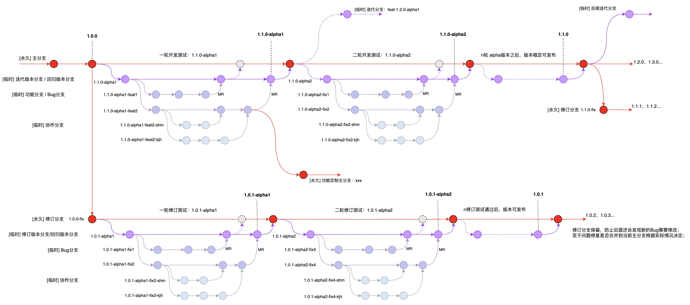

基本目标是保证所有里程碑式的产物都能有对应的版本Tag跟踪，并且作为结果归档是不可改变的；

### 版本管理


#### 发布版本[Tag]

使用简单的语义化版本规范：`{主版本号}.{次版本号}.{修订版本}`，比如：1.0.0

`{主版本号}`：跟踪重大功能变动或重构升级；

`{次版本号}`：跟踪发布或迭代周期；

`{修订版本}`：跟踪版本发布之后的修订；


#### 测试版本[Tag]

约定在发布版本的基础上添加alpha后缀：`{主版本号}.{次版本号}.{修订版本}-{alpha版本}`，所以也可以称为alpha版本，比如：1.0.0-alpha1

测试版本作用：

```tex
发布版本是作为最终产物部署到生产环境的，测试版本作为发布版本之前的阶段性产物，是交给测试部进行内部验证的，最后一次测试版本通过后，转为发布版本；
```


#### 开发版本

约定在测试版本的基础上添加build后缀：`{主版本号}.{次版本号}.{修订版本}-{alpha版本}-{build版本}`，比如：1.0.0-alpha1-build1

一般构建工具，比如jenkins，都会记录一个构建序列，可以将其作为build号；

开发版本作用：

```tex
研发在开发功能或修改问题的过程中可能需要频繁的构建和验证，这些构建的过程产物不需要版本进行跟踪，但需要能够区分每次构建；
这样对于同一个alpha版本，在开发过程中方便确认当前部署验证的是哪次构建，特别是当存在多套环境要部署时，这种区分会显得更加重要；

开发版本不需要记录Tag，其目的就是为了减少Tag。版本Tag作为一种资源，我们希望对于同一个功能开发或问题修订，不要反复浪费多个版本，应该尽量在开发验证环节将问题结束掉；
```


### 场景示例

#### 迭代开发

```tex
首轮迭代开始，产品规划起始版本 1.0.0

第一轮开发测试，开发过程基于版本 1.0.0-alpha1-{build号} 进行打包构建和部署验证，结束后出版本 1.0.0-alpha1 交给测试部进行回归验证；

第二轮开发测试（针对上一轮测出的问题，以及新的功能开发），基于版本 1.0.0-alpha2-{build号} 开发，结束后出版本 1.0.0-alpha2 交给测试走回归验证；

...

重复过程，直至在版本 1.0.0-alpha{N} 问题全部解决，发布迭代版本 1.0.0


下一轮迭代，产品规划版本1.1.0，然后以同样的方式进行开发和测试，直至可以发布迭代版本 1.1.0；
```


#### 版本修订

针对已发布的版本，如果出现Bug（理论上应该尽力避免这种情况），那么我们可以找到版本对应的Tag，check出分支进行修改，然后验证并发布对应的修订版本；

```tex
假设发布版本 1.0.0 出现Bug，那么它对应第一次的修订版本为 1.0.1，过程基本同上面迭代开发；

第一轮修订测试，修订过程基于版本 1.0.1-alpha1-{build号} 进行构建验证，结束后出版本 1.0.1-alpha1 交给测试进行回归验证；

第二轮修订测试（如果alpha1还存在问题），基于版本 1.0.1-alpha2-{build号} 修订，结束后出版本 1.0.1-alpha2 再交给测试走回归验证；

...

重复过程，直至在版本 1.0.1-alpha{N} 问题全部解决，发布修订版本 1.0.1


这样可能也没有完全解决问题，如果此时发布的版本已经到了 1.5.x，那么 1.1.x 到 1.4.x 的发布版本中是否都存在此Bug，是否都要进行修订；
此时，要么针对中间版本分别发布修订版本，比如将 1.1.2 修订为 1.1.3，将 1.2.4 修订为 1.2.5，修订过程同上面的 1.0.1;
或者，直接放弃中间版本的修订，只承诺在 1.5.x 及之后的版本中解决此Bug；
```


#### 产品版本

以上的版本说明，是以具体的应用模块开发来作为跟踪对象（由研发负责）；但是对于一个产品，它可能包含多个应用，并且各个应用的版本不同；此时我们可以针对产品整体定义一个独立的版本路线，使用同样的版本管理方法；

对于产品的版本，可以交给（产品测试）负责，由他们负责将所有需要的应用模块收集，制定一个产品版本，同时记录产品版本与各个应用模块的版本关系；

建议：根据产品版本的规划来制定应用模块的版本，示例如下

```tex
假设当前的产品版本为 1.0.0，其中包含A、B、C、D四个应用模块；

现在规划开发产品版本 1.1.0，但是只需要变动其中的C、D；
那么在发布产品 1.1.0时，对应的应用模块版本是，A(1.0.0)、B(1.0.0)、C(1.1.0)、D(1.1.0)

下次规划开发产品规划 1.2.0，但只需要变动应用模块B（此时B的版本可以跳过 1.1.x，跟着产品直接进入 1.2.x）；
那么在发布产品 1.2.0时，对应的应用模块就是，A(1.0.0)、B(1.2.0)、C(1.1.0)、D(1.0.0)

类似的，对于每次产品版本的修订，也通过与上面同样处理
比如应用C的1.1.0版本需要修订为1.1.1，那么产品1.1.0和1.2.0如果要发布修订版本的话，分别如下：
产品版本（1.1.1），对应应用模块 A(1.0.0)、B(1.0.0)、C(1.1.1)、D(1.1.0)
产品版本（1.2.1），对应应用模块 A(1.0.0)、B(1.2.0)、C(1.1.1)、D(1.0.0)
```


### 分支管理

不管是以怎样的形式，开发都应该养成修改代码前先拉分支的习惯；以下是对如何拉取和管理分支，提出的一些规范建议；


### 场景示例

#### 迭代开发

一般的迭代开发，可以只保留一个主分支（通常是master，限制push与merge权限），然后在此基础上拉取临时分支进行开发验证；

```txt
版本分支：基于主分支创建的临时分支（限制push与merge权限），比如1.1.0-alpha1，用于跟踪一个开发测试周期，一般在周期结束时创建Tag，合入主分支后删除；

需求分支：基于版本分支拉取的临时分支（用于具体的需求开发和验证），比如1.1.0-alpha1-feat{需求Id}，当需求开发结束时申请（MR）合并到版本分支；

Bug分支：基于版本分支拉取的临时分支（用于修改和验证迭代过程中的一些问题），比如1.1.0-alpha1-fix{BugId}，当修改完成时申请（MR）合并到版本分支；

协作分支：如果一个需求或问题需要多人协作开发，可以继续拉取分支，比如1.1.0-alpha1-feat2-zhang3、1.1.0-alpha1-feat2-li4等；


分支的合并是相反过程，逐层进行合并，应该先基于要合并的分支进行构建，验证没问题再往上层分支合并；

合并到版本分支需要提交Merge Request，由评审人介入进行code review（评审人可以要求开发通过git rebase整理提交记录，合并掉一些重复且没有意义的commit-log，这样可以减轻代码评审的工作量，也使提交记录更清晰）

版本分支结束时（需要基于版本分支构建验证），应该先打Tag，然后再向主分支合并。至于版本分支是否要合并到主分支，需要根据实际情况来决定（可能版本分支会衍化成一个定制，成为独立的主分支）；

这样当经过几轮alpha版本之后，最终由产品测试确认应该修复的问题都已修复，可以发布版本：1.1.0
```


#### 版本修订

针对已发布的版本，如果出现Bug，那么先基于版本Tag创建修订分支（永久分支，比如版本1.0.0对应的修订分支为：1.0.0-fix），专门用于修订此版本后续的问题；

```tex
具体过程与上面类似：

版本分支：基于修订分支拉取的临时分支，比如在1.0.0-fix分支上第一次修订，拉取的版本分支为1.0.1-alpha1；

Bug分支：基于修订版本分支拉取的临时分支（用于修改和验证具体的问题），比如1.0.1-alpha1-fix{BugId}，当Bug改完之后，申请（MR）合并到版本分支；


对于修订分支是否要合并到主分支，要根据情况来决定（也许当前的主分支经过发展已经不再兼容，最坏的情况可能需要针对多个已发布的版本分别进行修订和发布）
```


#### 多环境

如果条件允许，有可能会将环境分成多个层次，比如：dev开发环境，beta测试环境，release预发布环境，以及prod生产环境；

此时对应会保留多个主分支（相对上面单个主分支，全部由开发进行管理，这里需要开发、测试、运维分权进行管理）：

```tex
master:  开发环境分支，还是由开发负责，开发环境基于此分支进行构建；
beat:    测试环境分支，由测试负责；开发在dev环境通过验证后，申请转测试，此时开发需要向测试承诺转测的功能正常；
release: 预发布环境分支，由运维负责；测试在beat环境验证通过之后，申请转发布，此时测试需要向运维承诺待发布的功能都正常；
prod:    生产环境分支，由运维负责；这一步可以是自动的，只要根据发布计划，将release分支的记录向prod同步就行；

这些分支的版本关系：master > beat > release > prod (具体建立多少个主分支，根据实际情况调整，这里作为一个参考说明)
```


#### 定制版本

一个应用可能存在不同的定制化需求，且互相不兼容，那么此时只有一个主分支就无法满足了；

```tex
可以创建多个主分支（通过一些简写标识来区分），来应对不同的定制开发，至于每个主分支中的版本开发管理则与上面保持不变；
```


#### 迭代重合

比如1.1.0正在某个alpha阶段，现在要开启1.2.0的迭代开发；

```tex
这种情况还是先拉取一个1.2.0-alpha1的版本分支，问题只在于是从主分支上拉，还是从1.1.0-{alpha版本}的迭代分支上拉；

如果1.1.0-{alpha版本}已经合并到主分支，那么就直接从主分支上拉取；

如果还未合并到主分支（可能不确定最终是否要合并主分支，比如一些试验性的功能，为了招标所开发的需求），
此时就看1.2.0是否要包含1.1.0所开发的内容，如果要包含就从1.1.0-{alpha版本}分支上拉，否则还从主分支上拉取；
```


#### 独立发布

比如一个迭代中原计划要开发多个功能，然后某个功能要提前单独发布（需求规划阶段应尽量避免）；

```tex
可能发生了破坏性的修改或重构，可以规划一个大版本号来拉取分支，专门用来跟踪这个功能及后续的变化；

或者走定制版本路线，新建一个主分支（区分当前主分支，独立命名）来跟踪变化，对应可以在发布版本时添加一个功能前缀；
```


### 提交规范

这里借鉴Idea中的Git提交插件，采用的Angular规范，规范的格式中包括3部分内容：Header、Body、Footer

- Header

  Header格式：` type(scope): subject` ，举例：`feat(用户模块): 新增用户查询接口`

  type：必填，表示提交类型，由如下选择（当然我们也可以自定义添加一些自己的type，保持格式统一就行）：

  ```tex
  feat：    (常用)新功能feature
  fix：     (常用)修补bug
  docs：    文档documentation
  style：   格式（不影响代码运行的变动,空格,格式化,等等）
  refactor：重构（即不是新增功能，也不是修改bug的代码变动
  perf:   性能 (提高代码性能的改变)
  test：  增加测试或者修改测试
  build:  影响构建系统或外部依赖项的更改(maven,gradle,npm 等等)
  ci:     对CI配置文件和脚本的更改
  chore:  对非 src 和 test 目录的修改
  revert: Revert a commit
  ```

  scope：选填（建议必填），用于说明commit的影响的范围，自行描述；

  subject：必填，commit的简短描述，比如变更的主要目的；

  

- Body

  对本次 commit 的详细描述，可分成多行，如果觉得Header中subject已经描述足够清楚了，则Body部分可以省略


- Footer

  Breaking changes:  提示不兼容的变动；

  Closed issues:  关闭的issue，对应的可以填写Jira任务或Bug单号，或者其它项目管理工具，比如TeamBeation等；

  [skip ci] ：标识是否跳过构建
  
  

对于流水线的构建动作可以通过commit-log来触发（不要通过推送Tag来触发，避免只是为了构建而产生一些没有意义的Tag）

```tex
可以约定触发构建的commit-log格式：[Build] 和 [Tag]

如果commit描述包含[Build]，那么push代码会触发构建，并且出包时会在版本后面上build后缀，比如：1.1.0-alpha1-build{构建号}；
如果同时包含[Tag]，那么构建出包的版本不会带上buil后缀，另外会打一个Tag推送仓库；

至于版本获取，根据各语言默认的约定来，比如Java应用可以从pom文件中获取；
```


### 附录：示意图


